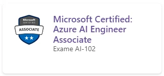

# Cloud: o que é, História e Guia da computação em nuvem

## Introdução: Cloud e Infraestrutura

A **computação** vem evoluindo de maneira absurda nas últimas décadas. E essa evolução se dá de tal forma, que o ser humano agora implementa tecnologia até nas nuvens!

Brincadeiras à parte, o Cloud está cada vez mais acessível aos usuários finais e sendo utilizada pelas empresas para manter uma **infraestrutura tecnológica escalável**.

Então, te convido a fazer esta leitura sobre ***Cloud Computing*** e infraestrutura, dois temas que no contexto atual da tecnologia se mostram cada vez mais importantes, tanto para as pessoas de infraestrutura, quanto para as pessoas desenvolvedoras!

## O que é Cloud?

Atualmente, muito se fala sobre computação em nuvem:

- "Meus dados estão subindo para o Dropbox!" ou
- "Minha empresa está usando a nuvem como ferramenta de escritório para uso no dia a dia!" ou
- "Somos uma pequena empresa e utilizamos uma infraestrutura na nuvem"

## Afinal, o que é essa “nuvem”?

Uma nuvem pode ser entendida como um **conjunto de aplicações, armazenamento e computação que tem a internet** como base e plataforma de funcionamento. E esse pool de serviços possui capacidade suficiente para dar suporte à maioria das necessidades de grande parte dos usuários.

## Qual é a função da nuvem?

Imagine que você está desenvolvendo um relatório importante junto com seu colega de trabalho, utilizando um aplicativo de edição de texto em seu próprio computador enquanto compartilha sua tela para que ele possa acompanhar em tempo real as alterações do arquivo. Vocês estão fazendo um ótimo progresso, mas de repente, sua máquina descarrega e você percebe que não está com seu carregador, então começa a se preocupar temendo que todo o trabalho realizado até agora tenha sido perdido. Situação estressante, não é mesmo?

No entanto, imagine agora que você está utilizando um armazenamento em nuvem com um backup automático. Isso quer dizer que o seu arquivo estava sendo salvo continuamente na nuvem, dessa forma, você pode utilizar outra máquina para recuperar o arquivo atualizado e retomar o trabalho de onde você parou. Esse é um dos exemplos que podem demonstrar a importância de usar as funcionalidades da nuvem ao seu favor, garantindo o armazenamento de seus documentos e podendo lidar mais facilmente com situações inesperadas.

Mas quais são as funcionalidades da nuvem? Será que existem outros recursos que poderiam ter ajudado nessa situação e em outras semelhantes do seu dia a dia?

Bem, um dos recursos mais populares da nuvem é o **armazenamento de dados**. Historicamente, os dados eram armazenados localmente em discos rígidos, SSDs (Solid State Drives) e outros dispositivos de armazenamento físicos. No entanto, com os avanços tecnológicos, a opção de armazenamento em nuvem surgiu e se tornou mais atrativa, permitindo que os usuários armazenem seus dados de forma segura e acessível em servidores remotos.

Esses serviços de armazenamento em nuvem são oferecidos por provedores, como o Google, Microsoft, Amazon e Dropbox, e nos permite acessar nossos dados de qualquer dispositivo conectado à Internet pública ou uma conexão de rede privada. Essa possibilidade elimina a necessidade de fazer transferências manuais de arquivos, além de ser uma opção confiável para **backups e recuperação de dados**, garantindo a disponibilidade dessas informações em caso de falhas ou desastres.

Outro recurso permitido é o **compartilhamento de arquivos**. Puxando o exemplo anterior, ao invés de compartilhar sua tela enquanto faz a edição de um documento importante para que outras pessoas tenham acesso às alterações em tempo real, a nuvem facilita essa colaboração e compartilhamento de arquivos entre equipes e pessoas.

Ferramentas como o Google Docs, Google Drive, Microsoft OneDrive, iCloud, Trello, entre várias outras, permitem que as pessoas criem, acessem, editem e colaborem em arquivos como documentos, fotos, planilhas e apresentações, enquanto sincroniza e salva os documentos em tempo real na nuvem. Para usufruir desses artifícios, você precisa apenas de um dispositivo com conexão à Internet.

É possível também utilizar a nuvem para **hospedagem de aplicativos**, permitindo que pessoas desenvolvedoras e empresas hospedem e gerenciem seus aplicativos de maneira escalável e confiável, eliminando a necessidade de configuração e manutenção de servidores físicos, utilizando serviços como a ***Amazon Web Services (AWS)*** e o ***Microsoft Azure***. Além disso, pode-se usar a nuvem para trabalhar com **processamento de dados**, a fim de executar tarefas computacionais de processamento, análise e armazenamento de grandes volumes de dados.

Todas essas funcionalidades, e mais outras, são possíveis na computação em nuvem, sendo algo flexível, eficiente e acessível para todas as pessoas. Mas você já se perguntou onde ficam armazenados esses arquivos na nuvem? No próximo tópico vamos falar um pouco mais sobre isso.

## Onde ficam os arquivos na nuvem?

Respondendo à pergunta anterior, os arquivos armazenados na nuvem ficam localizados em servidores remotos que são mantidos por provedores de serviços em nuvem. Esses provedores investem em infraestrutura robusta de data centers em diferentes localizações geográficas, que garantem a disponibilidade de recursos de computação, armazenamento, segurança e confiabilidade dos dados a serem adicionados na nuvem. Alguns desses provedores já devem ter sido utilizados por você, tais como: Amazon Web Services (AWS), Microsoft Azure, Google Cloud Platform, Oracle Cloud, entre outros.

Caso você já tenha utilizado um smartphone com o sistema operacional Android, você já deve ter percebido a presença de serviços do Google, como o Google Drive, para armazenamentos de arquivos em geral, e o Google Photos para o armazenamento de vídeos e fotos. Isso se deve, pois o Google é o provedor de serviços em nuvem padrão do Android, assim como a Apple é o provedor de serviços em nuvem padrão para o iOS, mesmo que o Google Cloud e o iCloud sejam disponibilizados para ambos os sistemas operacionais.

Isso mostra que esses provedores de serviços também oferecem recursos de backup, recuperação de dados em casos de desastres, serviços de inteligência artificial - como Google Assistant e Siri, entre outros. Existem diversas maneiras de acessar esses serviços diretamente, que é o que comentaremos a seguir.

## O que é um aplicativo Cloud?

Com o aumento das demandas de armazenamento, processamento e acesso a dados, foram desenvolvidos os aplicativos Cloud para atender a essas necessidades e facilitar o acesso aos diversos serviços oferecidos pela computação em nuvem. Essas aplicações são softwares executados em servidores remotos na nuvem, diferente dos aplicativos tradicionais que necessitam ser instalados e executados localmente em nossos computadores pessoais ou smartphones.

Dentre as diversas razões para utilizar esses aplicativos, podemos citar:

- **A acessibilidade e flexibilidade**, visto que eles podem ser acessados em qualquer lugar e em qualquer momento, apenas requerendo acesso à internet, além de permitir o acesso em diferentes dispositivos e simultaneamente;
- **A escalabilidade**, pois esses aplicativos podem escalar facilmente para se adequar a demanda e a quantidade de usuários crescente, permitindo o acréscimo de recursos conforme a necessidade das pessoas usuárias ou da empresa solicitante;
- **A redução de custos**, diminuindo a necessidade de investimentos em infraestruturas físicas e possibilitando opções de assinaturas mais econômicas na nuvem;
- **Ambientes colaborativos**, em que vários usuários e usuárias podem acessar e trabalhar em um mesmo aplicativo ou documento simultaneamente, facilitando o trabalho em equipe e a troca de informações em tempo real.

Estas são apenas algumas das diversas outras vantagens verificadas com a utilização de aplicações em nuvem no nosso dia a dia. Será que existem outros serviços que vemos nas nossas rotinas? Veremos mais alguns exemplos nos próximos tópicos.

## Exemplos do uso de Cloud no dia a dia

Como exemplos de Cloud para uso pessoal temos as ferramentas de armazenamento e partilha de arquivos, como o Gmail e o Google Drive, o Dropbox e o OneDrive.

Além dessas ferramentas, também temos o **Spotify**, que presta um serviço de streaming de música, podcast e vídeo. Ou, ainda, outro exemplo muito conhecido: a **Netflix**, que em 2007 lançou seu serviço de streaming de vídeo, usando a nuvem para transmitir filmes e outros conteúdos. Mas, para o mundo da tecnologia, a nuvem traz um significado e utilização muito mais abrangente do que vimos até aqui.

É interessante ressaltar também que, com o surgimento do termo “computação em nuvem”, uma visão da **oferta de serviços de infraestrutura física ou virtual** passou a ser realizada por meio de software, normalmente pago, o que reduz e terceiriza a infraestrutura do usuário.

- ### [O que é cloud? #HipstersPontoTube](https://www.youtube.com/watch?v=wev9fMrg-TU)

Agora que você já sabe o que é ***cloud computing*** e como funciona, é importante entender a origem desse conceito e como ele foi se transformando com o passar do tempo. Apesar de ter ganho destaque nos últimos anos, a computação em nuvem, como conceito, existe desde os anos 1950, em um momento em que a tecnologia era bem mais escassa, muito cara e em que as empresas possuíam pouquíssimos computadores.

Mas é na década de 1960, com o surgimento dos primeiros sistemas de compartilhamento de tempo, é que tivemos as primeiras aplicações que ofereciam a possibilidade de utilização de recursos compartilhados por meio de uma rede.

Nessa mesma época, John McCarthy propôs o uso do computador de forma compartilhada por dois ou mais usuários, nascendo a ideia de “***Utility Computing***”, na qual ele defendia a possibilidade de vender a computação como uma utilidade, como vendemos água ou eletricidade; porém, essa ideia de vender computação como um serviço estava alguns anos adiantada no tempo.

Em 1997, o termo ***Cloud Computing*** nasce oficialmente em uma palestra proferida pelo professor de sistemas Ramnath Chellappa. E assim, dentro de pouco tempo, as empresas passariam a **trocar sua infraestrutura de hardware por serviços disponíveis em nuvem**.

Hoje o termo ***Cloud Computing***, que se refere à computação em nuvem, é algo cada dia mais presente na vida das pessoas e nas organizações.

- ### [Histórias do Cloud Hipsters Ponto Tech #04](https://open.spotify.com/episode/7L8kFq2Bbbv9MDjPIpMBw8?go=1&sp_cid=3065938fa6b34a5dd98309e9f6a48e5a&utm_source=embed_player_p&utm_medium=desktop&nd=1&dlsi=1baf38f70d344e52)

### Principais assuntos deste episódio:

- #### Clouds;
- #### Migrar ou não para o Cloud;
- #### Histórias de projetos reais com Cloud;
- #### Custos e investimentos.

## Por que usar Cloud?

Com a utilização de uma solução em Cloud, as empresas têm a possibilidade de utilizar **recursos de armazenamento e computação** de forma compartilhada e delegar a manutenção de sua infraestrutura, reduzindo drasticamente os seus custos.

### Ao implementar soluções Cloud, podemos obter:

- **Redimensionamento da infraestrutura** (servidores e máquinas virtuais) para atender a demanda de carga;
- **Recursos liberados** aos **usuários** por demanda;
- **Implementação de segurança** no acesso aos recursos de rede;
- **Empresas** que oferecem serviços de Cloud podem **oferecer e cobrar sobre o serviço**, conforme o uso do recurso.

## Quem pode usar o Cloud?

Com todos os recursos e serviços disponíveis, é interessante sabermos a abrangência da computação em nuvem. O Cloud não restringe o uso a um grupo específico de pessoas, sendo disponível para qualquer usuário ou usuária que deseja aproveitar os benefícios dessa tecnologia.

Podemos citar alguns exemplos de pessoas que podem utilizar essa tecnologia:

- **Indivíduos** - qualquer pessoa que tenha acesso à Internet;
- **Empresas** - organizações de todos os setores podem utilizar os recursos para uma variedade de fins, desde pequenas empresas e startups, a empresas grandes;
- **Organizações Governamentais** - entidades mantidas pelos governos, seja Federação, estados ou municípios;
- **Pessoas Desenvolvedoras** - desenvolvedores e desenvolvedoras de softwares e equipes de TI.

## O que preciso saber sobre Cloud antes de começar a usar?

A computação em nuvem é baseada em demanda, isso significa que você pode acessar os recursos da nuvem conforme sua necessidade, podendo aumentar seus recursos ou reduzi-los no momento em que desejar. Para acessar seus arquivos e serviços em nuvem, é necessário apenas ter uma conexão estável com a Internet.

Um ponto importante a se considerar é a segurança, portanto, recomendamos que sempre se familiarize com as práticas de segurança recomendadas pelo serviço que você está utilizando, a fim de aumentar a confiança no serviço em nuvem e proteger seus dados de maneira correta, adotando medidas preventivas de segurança. Isso inclui a escolha de senhas fortes, a utilização de autenticação de dois fatores, a atualização regular de software e a conscientização sobre práticas seguras de navegação na Internet.

É interessante entender também que a Cloud trabalha com três principais modelos de serviço em nuvem: IaaS (Infraestrutura como Serviço), PaaS (Plataforma como Serviço) e SaaS (Software como Serviço), que vamos conhecer melhor no tópico Modelos de Cloud, e saber a diferença entre eles pode ajudar você a escolher o serviço mais adequado para suas necessidades.

## Vantagens do Cloud

A ***Cloud Computing*** traz às empresas e às organizações que utilizam esse tipo de serviço, uma série de **benefícios** que nos ajudam a entender o porquê esse **modelo de serviço de computação** já se mostra como um marco na evolução tecnológica:

- Possibilita que o trabalho possa ser realizado a partir de qualquer lugar e que sejam utilizados programas e aplicações em diferentes dispositivos baseados em internet, o que leva a uma **otimização do trabalh**o de equipes inteiras;

- Oferece **agilidade nos processos**, já que podemos consumir os dados via aplicativos e navegadores web;

- Gera **maior velocidade de processamento e armazenamento**, uma vez que os provedores de serviço *cloud* podem destinar recursos computacionais nesta infraestrutura remota muitas vezes superiores aos encontrados na infraestrutura físicas das empresas;

- As empresas de *cloud* ficam responsáveis por implementar e garantir **redundância de serviços, backups de segurança e disponibilidade do serviço 7x7**;

- A implementação de uma infraestrutura *cloud* remota **reduz os gastos com a manutenção e disponibilidade de uma infraestrutura de TI** pelas empresas;

- Em **vantagem competitiva**, empresas que implementam *cloud* podem obter maior agilidade em comparação às concorrentes que ainda gerenciam toda a sua infraestrutura de maneira tradicional.

## Desvantagens do Cloud

Na utilização da ***Cloud***, nem tudo são flores. Temos também alguns desafios que podemos entender como desvantagens. Destacamos algumas a seguir:

- **Dependência da rede**, o que gera a possibilidade de não conseguir acessar as informações ou aplicações caso não tenhamos conexão com a rede;

- Por se tratar de um serviço hospedado em algum data center, **falhas** na estrutura do data center ou em algum servidor **podem impedir o trabalho, ou uso do recurso oferecido pela nuvem**;

- Alguns provedores oferecem o uso compartilhado de recursos entre diferentes empresas e utilizadores, o que pode gerar **falhas de acesso**;

- Problemas relacionados à **segurança de dados**, como, por exemplo, perda ou sequestro.

## Modelos de Cloud

Hoje em dia, existem 3 modelos de serviços de ***cloud computing*** utilizados para atender às necessidades das empresas. Vale a pena salientar que os riscos e benefícios que cada modelo de computação em nuvem pode trazer devem ser levados em consideração na hora de contratar o serviço.

## IaaS - Infrastructure as a Service

A **Infraestrutura como Serviço** oferece recursos de computação, armazenamento e rede. Ou seja, esse modelo disponibiliza um ambiente com uma infraestrutura virtualizada.

### Como exemplos de serviços IaaS:

- #### [Amazon Web Services](https://www.alura.com.br/artigos/aws)
- #### [Google Compute Engine](https://cloud.google.com/products/compute)

## PaaS - Plataform as a Service

Na **Plataforma como Serviço**, temos um programa ou aplicativo entregue com o objetivo de facilitar a implementação de algum serviço; ou seja, é criado um ambiente para a **programação** e o desenvolvimento de alguma solução.

### Alguns exemplos de PaaS são:

- Heroku;
- Red Hat OpenShift.

## SaaS - Software as a Service

No **Software como Serviço**, o software é executado em um servidor, de forma que o cliente não precisa tê-lo instalado em sua máquina.

### Como exemplos de SaaS, encontramos ferramentas como:

- **Gupy**, plataforma online de recrutamento e seleção;
- **Trello**, plataforma utilizada para gerenciamento de tarefas e projetos.

Esse modelo ainda possui alguns desafios, como a **integração** com recursos internos da organização e a **disponibilidade**, além da segurança da informação.

## Tipos de Cloud

Atualmente, existem basicamente três tipos de Cloud que podemos contratar. São eles:

## Cloud Pública

Este sem dúvida é o tipo de serviço de cloud que **mais vemos em utilização pelas empresas**. Nele, os serviços são mantidos por um determinado provedor de serviços.

Esses provedores possuem uma série de data centers com uma gama de **servidores interconectados** que compartilham recursos e serviços pelos utilizadores da nuvem.

## Cloud Privada

Este tipo de serviço oferece uma **infraestrutura alocada** para uma única organização. Uma nuvem privada pode estar hospedada no data center mantido pela própria empresa.

## Cloud Híbrida

Uma nuvem híbrida é a **utilização em conjunto** da **nuvem pública e da privada**. Um cenário muito comum seria o de usar uma nuvem pública para manter a execução de algum sistema e manter a fonte de dados da aplicação na nuvem privada.

Quando estamos falando do ambiente de nuvem, podemos nos deparar com o termo ***On Premise***, que é um tipo de organização da nossa estrutura em um ambiente só. Um ambiente ***On Premise*** É quando temos toda a infraestrutura de servidores e máquinas em um espaço físico na empresa, a famosa “sala de servidores” ou CPD. Em contrapartida a esse ambiente, temos o ambiente da nuvem.

## Multicloud

Em uma multicloud, encontramos a **utilização de mais de um serviço de provedores** de nuvem pública ou privada. Por definição, “toda nuvem híbrida é uma multicloud, mas nem toda multicloud é uma nuvem híbrida”.

A escolha de uma abordagem multicloud, combinando a utilização de mais de um provedor de serviços em nuvem, pode favorecer estratégias que possibilitam:

## 01- Diminuir a indisponibilidade

Imagine a situação na qual a sua **infraestrutura está hospedada em uma única nuvem**; se ocorrer alguma falha de segurança generalizada neste provedor ou esse ficar indisponível devido ao fato do data center ter sido alvo de algum tipo de desastre natural, sua operação poderá ficar offline.

Em uma abordagem multicloud, você pode reduzir drasticamente os problemas oriundos desses cenários **replicando dados** e **serviços** para outro provedor.

## 02- Redução de custos

Utilizando multicloud, podemos gerar um ambiente que promova a **redução de custos**, pois podemos aumentar a quantidade de recursos necessários em um momento que temos à disposição mais recursos financeiros, ou diminuí-los, desativando recursos de acordo com a necessidade.

Em resumo, podemos **distribuir a carga de trabalho entre as nuvens contratadas** com o objetivo de obter o melhor retorno.

## 03- Melhor resposta a desastres

Por utilizar mais de uma cloud e de forma independente uma das outras, se por acaso uma ficar indisponível, o seu **sistema pode não cair totalmente**. Além disso, existe a possibilidade de implementarmos a cópia de segurança de dados de aplicações em outra nuvem.

## 04- Flexibilização geográfica

Apesar das empresas de cloud manterem data centers ao redor do mundo, por vezes é necessário que determinados **dados estejam alocados em países específicos** por questões de legislação. Na estratégia multicloud, podemos atender essa demanda com mais facilidade.

## 05- Usando o melhor de cada um

Temos à disposição uma série de provedores de cloud e cada um tem uma força em algum grupo de serviços específicos. Na abordagem multicloud, podemos escolher o serviço de cloud que melhor atenda a um requisito de nossa solução.

## As principais plataformas de Cloud

- ### [AWS, Google Cloud e Azure: Por onde começar? | Hipsters.Talks](https://www.youtube.com/watch?v=z9k6rsdmWc0)

Na atualidade, existem muitos fornecedores de serviços de cloud, mas os maiores são:

## AWS ou Amazon Web Services

É a plataforma de cloud da Amazon. Lançada em 2006, provê uma série de serviços para pessoas desenvolvedoras e empresas hospedarem e manterem aplicações e infraestrutura.

## Azure

**A Microsoft também possui sua plataforma de nuvem** com a oferta de produtos e serviços em tecnologia, o Azure. Ele foi apresentado ao mundo em 2008 com o nome de Windows Azure, mas somente em 2010 teve o seu lançamento oficial para o mercado. Em 2014, passou a ser chamado de Microsoft Azure, como é conhecido até hoje.

Créditos: Microsoft Azure

O Azure é uma plataforma de computação em nuvem que se destina à criação, execução e gerenciamento de aplicativos em diversas nuvens, locais, de borda (armazenamento/processamento "próximo" de onde os dados são gerados) e uma série de recursos e ferramentas para infraestrutura.

## Google Cloud

Créditos: Google Cloud Platform

**Plataforma do Google** que entrega uma suite (conjunto de ferramentas) para computação em nuvem, o que possibilita criar, implantar e gerenciar aplicativos na nuvem, além de oferecer infraestrutura para hospedagem de sites, máquinas virtuais, bancos de dados, entre outros.

## Como funciona o Google Cloud?

O Google Cloud é um conjunto de recursos físicos e virtuais, que oferece uma ampla variedade de serviços e soluções que se encontram localizados nos data centers do Google por todo o mundo. Esses data centers estão localizados na Ásia, Austrália, Europa, América do Norte e América do Sul e estão interconectados por uma rede de alta velocidade que apresenta a capacidade de fornecer serviços em nuvem escaláveis, seguros e confiáveis, com redundância em caso de falha e latência reduzida.

A plataforma é altamente flexível e permite que você escolha os serviços que atendam suas necessidades específicas. É importante ressaltar que o uso do Google Cloud envolve custos e eles disponibilizam os modelos de cobrança e opções de preços para os diferentes serviços. É recomendado avaliar e planejar adequadamente suas necessidades para garantir que você esteja utilizando os recursos de maneira mais eficiente e econômica.

## Por que usar o Google Cloud?

Dentre a ampla gama de serviços e produtos oferecidos, podemos citar:

- **Serviços de computação**, como o Compute Engine para a criação de máquinas virtuais (VMs) e o Google Kubernetes Engine para a execução de aplicativos em contêineres usando o Kubernetes.

### [Terraform e máquinas virtuais no Google Cloud](https://www.youtube.com/watch?v=yKnkK4HxW8E&t=3s)

- **Armazenamento** e **banco de dado**s, como o Cloud Storage para armazenamento de objetos seguro, durável e escalável e **Cloud SQL** para banco de dados relacional gerenciado;
- **Serviços de análise de dados**, como o **BigQuery** que é um serviço de data warehousing que permite consultas rápidas e escaláveis em grandes conjuntos de dados e o **Dataflow** que permite a análise e processamento em lotes de dados e streams;
- **Inteligência Artificial** e **Machine Learning**, como o **Vertex AI** que é uma plataforma unificada que permite criar, treinar e implantar modelos de machine learning em escala e o **Vision AI** que fornece serviços de visão computacional para análise de imagens.

E esses são apenas alguns dos mais de 100 produtos disponibilizados pela Google Cloud, além de recursos avançados de segurança, como criptografia de dados, autenticação e controle de acesso e também ferramentas de monitoramento, gerenciamento e escalabilidade para ajudar os usuários a administrar seus recursos em nuvem de forma eficiente.

## Adobe Creative Cloud

A Adobe Creative Cloud é uma coleção de aplicativos e serviços ofertados pela Adobe, muito utilizados por profissionais de criação, editoração e design. Esse serviço é baseado em um modelo de assinatura, na qual os usuários pagam um valor mensal ou anual para utilizar os aplicativos.

### Alguns dos aplicativos mais conhecidos são:

- **Photoshop**;
- **Illustrator**;
- **InDesign**;
- **Premiere Pro**;
- **After Effects**; *Lightroom.

Há ainda diversos outros apps atualizados regularmente pela Adobe. Além disso, o Creative Cloud também fornece serviços de armazenamento em nuvem, colaboração em equipe, integração entre aplicativos e serviços, entre outros recursos bastante úteis no cotidiano.

## Outros provedores de Cloud

Como já mencionamos, esses 3 são considerados os maiores provedores de cloud disponíveis no mercado, mas também existem outros provedores de grande relevância, como o da **IBM**, o **Oracle** e o **VMWare**, além de muitas outras opções. Todos eles valem um pouco da sua atenção, beleza?

## Nuvem como Plataforma de Desenvolvimento: ferramentas de programação

O tema **Cloud** não fica restrito somente às equipes de infraestrutura de TI. Esse assunto é cada vez mais importante no radar das pessoas desenvolvedoras, pois, com a grande adesão ao **trabalho remoto**, conhecer e utilizar a nuvem tornou-se algo necessário.

Isso se alinha também com um **perfil profissional** que não só conhece profundamente uma **tecnologia** ou **linguagem de programação**, mas conhece também outras hard skills para dar suporte à sua carreira. É o que define o conceito de **Dev em T**.

### [Dev em T: programação, carreira e tipos de perfil](https://www.youtube.com/watch?v=_nCESq0ggRg)

E, neste cenário de nuvem, quais ferramentas a pessoa desenvolvedora tem à disposição? A resposta é: muitas! Mas, selecionamos algumas e vamos listar os maiores destaques abaixo:

### GitHub

Adquirido em 2018 pela Microsoft, o GitHub é uma plataforma online para controle e versionamento do código de aplicações e, sem dúvida, é a ferramenta mais utilizada por desenvolvedores ao redor do mundo. Ela possibilita que qualquer pessoa, mediante um cadastro, possa contribuir com projetos públicos ou privados.

O GitHub é um serviço baseado em nuvem, que opera sobre o famoso controle de versão Git. A plataforma possui uma interface amigável, o que ajuda a entender sua popularidade, e também permite a colaboração e o controle de projetos de forma simples e remota.

Créditos: GitHub

Conhecer o GitHub é essencial para as pessoas desenvolvedoras em todos os níveis, de juniores a seniores.

## Heroku

É uma plataforma de serviço em nuvem no modelo PaaS (Plataforma como Serviço). A **Heroku** dá suporte a várias linguagens de programação, permitindo a hospedagem, configuração, teste e publicação. O interessante é que ela possibilita implementar toda uma infraestrutura para deploy de uma aplicação. Outra coisa bacana é que você pode utilizá-la para aplicações não comerciais e até mesmo projetos pessoais.

Créditos: Heroku

## Replit

Essa plataforma, fundada em 2016, oferece um ambiente integrado para desenvolvimento online, possibilitando que você crie projetos online e escreva códigos na maioria das linguagens disponíveis. A ideia da Replit é realmente transformar o seu navegador em um IDE (Integrated Development Environment).

Créditos: Replit

Essa solução de codificação em nuvem é muito interessante para as pessoas iniciantes em desenvolvimento, pois somente é necessário ter acesso à internet e a um navegador. Também é uma opção para situações em que a pessoa não possui uma máquina com processamento para rodar algumas IDEs de mercado.

## Cloud Code

É uma ferramenta da Google que entrega um conjunto de plugins para ambientes de desenvolvimento que se integram com o Google Cloud para a criação e implantação de aplicativos.

Créditos: Cloud code

O **Cloud Code** é compatível com ferramentas como o PyCharm, o VSCode e o IntelliJ. Também se integra com facilidade com as APIs do Google, como o Google Maps, por exemplo.

## Resumo das Ferramentas de Programação

Algumas dessas plataformas podem ser classificadas como **Cloud Coding** e nos entregam, por meio do navegador, todo um ambiente para escrita, compilação, interpretação e gerência de código.

### Recapitulando as ferramentas que nos aprofundamos aqui:

- **GitHub**;
- **Heroku**;
- **Replit**;
- **Cloud Code**.

### [Como desenvolver boas práticas de programação? com Fabio Akita](https://www.youtube.com/watch?v=GUanHEGlje4)

## Cloud e DevOps

Ao falarmos em Cloud, tocamos muito no termo **infraestrutura**, ou infra, para descrever a **estrutura** que pode englobar **servidores, aplicações, containers**, máquinas virtuais e uma série de outras funcionalidades que podem compor a **arquitetura de TI** de uma empresa ou organização.

No contexto da TI, a infra vai suportar as operações e o gerenciamento dessa arquitetura, que pode ser On Premise ou que vai estar em alguma nuvem; de outro lado, temos as equipes de desenvolvimento que precisam da infra para colocar a sua aplicação para rodar.

Historicamente, os setores de operações (infra) e desenvolvimento tiveram uma relação um tanto antagônica, e é nesse cenário que surge a **cultura DevOps**, que tem por objetivo quebrar possíveis barreiras entre essas duas equipes para proporcionar uma maior colaboração e ao final, entregar um produto ou serviço de qualidade para o cliente, visto que o objetivo é sempre esse.

## O que é DevOps?

Shutterstock / ID: 2197141741

Então, vamos dar uma definição para DevOps: é um conjunto de processos, técnicas ágeis e ferramentas que ajudam a **entregar uma solução da sua concepção até a implantação em produção**, gerando valor para o nosso usuário, e em um contexto de **colaboração** entre equipes de desenvolvimento e operações.

### [O que é Devops?](https://www.youtube.com/watch?v=3_k2GVkMt30)

## União entre Cloud e DevOps e resultados

Então, associando as ideias e princípios Devops ao Cloud, podemos criar um cenário com maior **integração**, adotando melhores práticas e ferramentas ao ponto de podermos pensar em uma **infraestrutura de TI** que **automatiza processos de desenvolvimento**.

Por exemplo, em um cenário onde um commit em um repositório de códigos, como o GitHub, possa iniciar um processo de ***build***, testes e implantação da solução para o cliente em ambiente de produção. E tudo isso rodando em alguma nuvem!

### [que você precisa saber para começar em DevOps com Leonardo Sartorello](https://www.youtube.com/watch?v=IQ8-_khQATQ)

## Certificações

Como em várias áreas da tecnologia, hoje temos uma série de conteúdos que nos permitem aprender um determinado assunto, como programação, banco de dados, redes, etc. Em relação à computação em nuvem, não seria diferente: temos à nossa disposição cursos livres e até graduações que abordam o Cloud Computing.

E, nesse cenário, também temos as certificações, em que empresas como Amazon, Microsoft ou Google atestam habilidades e conhecimento técnico em alguma de suas tecnologias, o que pode, em alguns casos, ser um diferencial em seu currículo.

### [Certificação em Cloud: Azure, AWS, Google | Hipsters.Talks](https://www.youtube.com/watch?v=W4K82n_WK5g)

Em **Cloud Computing**, além das empresas já citadas, temos também alguns institutos que podem certificar profissionais. Abaixo, listamos algumas dessas certificações.

### AWS Certified Solutions Architect

Para a **certificação AWS Certified Solutions Architect**, o profissional deve apresentar os conhecimentos teóricos e técnicos específicos para poder planejar, implementar e executar as demandas para soluções na infraestrutura da AWS.

Créditos: Amazon Web Services

Atualmente, essa certificação possui 4 níveis:

- **Básico**: verifica o conhecimento do profissional sobre os conceitos de cloud computing e dos serviços essenciais da AWS;

- **Profissional**: observa a capacidade do profissional em projetar, implantar aplicações e automação de testes, além de realizar a implantação de infra na AWS;

- **Associado**: atesta que o profissional demonstra a capacidade de implementar sistemas distribuídos com a AWS; e

- **Especialista**: certifica que o profissional possui conhecimentos sobre arquitetura de redes, base de dados e que consegue trabalhar com Machine Learning, além de implementar segurança.

Para saber mais sobre as certificações AWS, você pode acessar a página oficial da certificação.

## Cloud Institute Certifications

A **Cloud Institute** é uma instituição global que mantém um portfólio de programas de certificações neutras, ou seja, não vinculadas a nenhuma empresa, e que oferece serviços de cloud.

Seu foco é certificar especialistas em cloud, arquitetura, segurança e governança, e tem como base para o programa o National Institute of Standards and Technology (NIST), do Departamento de Comércio Norte Americano.

Créditos: Cloud Institute

A **Cloud-Open** ou COE é uma introdução à cloud computing, abordando IaaS, PaaS e SaaS, bem como as vantagens, as desvantagens e as características da tecnologia. Já as certificações **Cloud-Architect** e **Cloud-Professional** vão mais a fundo nos assuntos da tecnologia, abordando implementação, modelos de negócio, segurança e conhecimentos técnicos de cloud.

Para saber mais sobre as certificações, acesse a página oficial da ***Cloud Institute***.

### Certificações Azure

A Microsoft também oferece um portfólio de certificações para a sua plataforma de cloud, conhecidas como **Certificações Azure**. Elas estão divididas em 3 níveis, conforme listamos abaixo:

- **Fundamentos**: atesta que o profissional tem um conhecimento básico sobre Cloud;

- **Associado**: verifica que o profissional possui conhecimentos práticos, algo mais “mão na massa” mesmo; e

- **Expert**: certifica que o profissional é um profundo conhecedor da arquitetura do Azure.

Hoje, o Azure oferece um total de 31 certificações, passando por administração de infraestrutura, Windows Server, até desenho e implementação de soluções para o Azure DevOps. Abaixo, indicamos as 3 certificações mais populares de Azure na plataforma Microsoft:

- **Microsoft Certified: Azure Fundamentals | Exame AZ-900**:

Créditos: Microsoft Azure

- **Microsoft Certified: Azure Developer Associate | Exame AZ-204**:

Créditos: Microsoft Azure

- **Microsoft Certified: Azure AI Engineer Associate | Exame AI-102**:

Créditos: Microsoft Azure

Para saber mais sobre as Certificações Azure, acesse a página oficial do **Microsoft Azure** e procure pela aba “Explorar Certificações e Exames”.

## Certificações Google Cloud

A Google também certifica profissionais para a sua nuvem, a Google Cloud. Assim como as Certificações Azure, as **Certificações Google Cloud** também estão divididas em 3 níveis:

- **Foundational**: valida o amplo conhecimento dos conceitos de nuvem e sobre os produtos e serviços, além de casos de uso do Google Cloud;

Créditos: Google Cloud

- **Associado**: avalia a capacidade do profissional em implantar e manter projetos em nuvem; 

Créditos: Google Cloud

- **Professional**: certifica o conhecimento sobre as principais funções técnicas e habilidades avançadas de desenho, implementação, gerenciamento de produtos e serviços do Google Cloud.

Créditos: Google Cloud

Essas foram apenas algumas das inúmeras certificações disponíveis na área de cloud. É importante destacar que as certificações podem ajudar muito em sua carreira, pois lhe mantém em constante estudo e aperfeiçoamento em uma determinada tecnologia. Porém, lembre-se que somente elas não garantem o seu sucesso. É de suma importância que você sempre busque se aprimorar, beleza?!

## Como fazer a migração para Cloud Computing na sua empresa?

Vimos até aqui, porque migrar para cloud pode ser vantajoso e quais as opções disponíveis conforme a necessidade da sua empresa. Contudo, como fazer essa migração na sua organização se você ainda não utiliza a nuvem? Confira a seguir algumas dicas.

1. Avalie as suas necessidades e faça um levantamento do que será migrado para a nuvem, levando em consideração quais aplicativos e dados são adequados para a nuvem, sempre considerando segurança, desempenho e conformidade;

2. Escolha o provedor de nuvem, avaliando qual atende melhor às necessidades da sua empresa e quais oferecem melhor custo, qualidade de serviço, disponibilidade geográfica, recursos e suporte;

3. Defina as estratégias e o planejamento para dar início à migração, desenvolvendo um plano detalhado e fazendo o levantamento das etapas necessárias e prioritárias a se migrar, como aplicativos, dados e infraestrutura, considerando os impactos nas operações e a segurança e dependências dos sistemas;

4. Faça uma **migração gradual**, priorizando inicialmente trabalhos menos críticos e aos poucos expandindo, avaliando o desempenho, fazendo testes e acompanhamentos para solucionar problemas e verificar o funcionamento das estratégias já estabelecidas;

5. Garanta a implementação de medidas de segurança adequadas na nuvem, como autenticação de dois fatores, criptografia de dados, acesso baseado em função e monitoramento contínuo, e mantenha-se atualizado com as práticas recomendadas de segurança na nuvem, além de cumprir as regulamentações aplicáveis;

6. Forneça treinamento e capacitação adequados para suas equipes, para garantir que elas estejam familiarizadas com os conceitos, tecnologias e práticas de gerenciamento em nuvem;

7. Estabeleça processos e ferramentas de monitoramento para acompanhar o desempenho, a utilização e os custos na nuvem, com a finalidade de, continuamente, identificar oportunidades de otimização e pontos de melhoria. É recomendado também, avaliar e refinar sua estratégia de migração;

8. Implemente uma estratégia de backup e recuperação de dados na nuvem, para garantir a proteção e a disponibilidade dos seus dados críticos, como backups regulares e testes de recuperação, para garantir a integridade dos dados.

O processo de migração para a nuvem é contínuo e requer adaptação regular e periódica. Tente envolver especialistas em nuvem, pessoas parceiras de serviços e consultoras para garantir uma migração bem-sucedida e maximizar os seus benefícios e aproveitamento da computação em nuvem em sua empresa.

## Aprenda mais sobre Cloud gratuitamente

Acesse gratuitamente as primeiras aulas da Formação Começando em Cloud Computing, feita pela Escola de DevOps da Alura e continue aprendendo sobre temas como:

- **Cloud Onboarding**: trabalhando com os principais provedores
- **Cloud Onboarding**: conhecendo os principais provedores parte 2
- **Linux Onboarding**: usando a CLI de uma forma rápida e prática
- **Linux Onboarding**: localizando arquivos e conteúdos
- **Redes onboarding**: uma perspectiva prática
- **Amazon EC2**: alta disponibilidade e escalabilidade em uma aplicação

### [Como aprender melhor?](https://www.youtube.com/watch?v=uOagLB3uyeU&t=1s)

## Apostilas — Você profissional em T

Com as **Apostilas de tecnologia** sobre Front-End, Programação, UX & Design e Ciências de Dados da Alura avance nos estudos e no desenvolvimento da sua carreira em T.

Você poderá se **aprofundar** nos seguintes tópicos:

- **Desenvolvimento Web** com HTML, CSS e JavaScript;
- **UX** e **Usabilidade** aplicados em **Mobile** e **Web**;
- **Java para Desenvolvimento Web;
- **Java** e **Orientação a Objetos**;
- **Python** e Orientação a Objetos;
- **C#** e Orientação a Objetos;
- **SQ**L e **modelagem** com banco de dados.

Baixe elas completas em: Apostilas da Alura - [Conteúdo livre para o seu aprendizado](https://www.alura.com.br/).

## Portfólio e Carreira em Tecnologia

### [Como fazer um bom portfólio](https://www.youtube.com/watch?v=gu1OXrirC0U)

## [5 projetos para sua carreira em tech](https://www.youtube.com/watch?v=nckXBdyqHVc)

## Conclusão

Acabamos de ter uma visão geral sobre os fundamentos da Cloud Computing, que hoje se apresenta como um **tema essencial** no **universo da tecnologia**, importante para os profissionais mais focados em infraestrutura e de igual relevância para as pessoas desenvolvedoras.

Seja como usuário final de clouds pessoais ou como profissional de tecnologia, entender esses **fundamentos de computação em nuvem** será de grande importância. Agora, é com você! Escolha uma cloud e foque nos estudos!

- ### [Artigo de André Bessa para Alura](https://www.alura.com.br/artigos/cloud)

### [Menu Conectando sua API](menu.md)