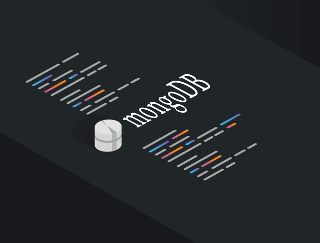
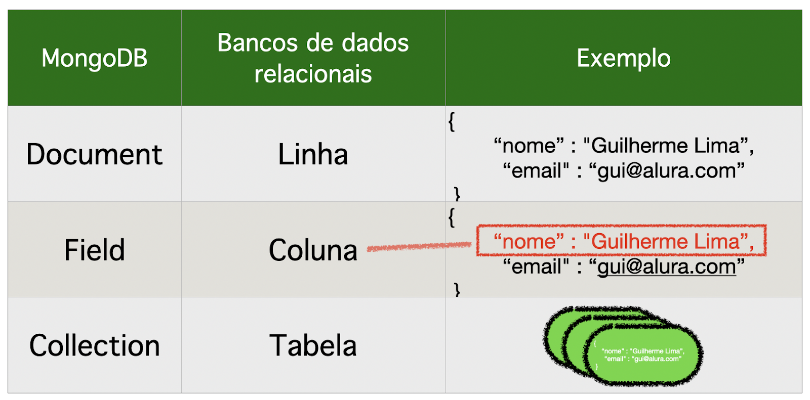

# MongoDB: O banco baseado em documentos



Segundo a [documentação oficial do MongoDB](https://www.mongodb.com/company/what-is-mongodb), o **Mongo** é um banco de dados baseado em documentos com a escalabilidade e flexibilidade, facilitando as consultas e indexação.

## Surgimento e cenário atual

Foi apresentado pela primeira vez em 2009 e fez um barulho no mundo dos bancos de dados. Desde então, ganhou popularidade rapidamente. De acordo com a *pesquisa para desenvolvedores StackOverflow de 2019*, o MongoDB está em quinto lugar, com 26% dos desenvolvedores profissionais e 25,5% de todos os entrevistados afirmando que usam o MongoDB.

O *DB-Engines* também classifica o MongoDB como o quinto banco de dados mais usado.

## O que significa “baseado em documentos”?

A principal diferença entre MongoDB e os principais sistemas tradicionais de bancos de dados relacionais conhecidos como **RDBMS**, é que, em vez de tabelas, linhas e colunas, a base para armazenamento no MongoDB é um documento.

Os documentos são normalmente modelados usando a formatação **JSON** e, em seguida, inseridos no banco de dados onde são convertidos em um formato binário para armazenamento.

Relacionado à base de documentos para armazenamento, está o fato de que os documentos MongoDB não têm esquema fixo. O principal benefício disso é a sobrecarga amplamente reduzida.

A reestruturação do banco de dados é fácil de ser aplicada e não causa os problemas massivos, travamentos de sites e violações de segurança observados em aplicativos que utilizam banco de dados relacionais.

## Quais as vantagens do MongoDB?

Outro recurso que faz com que o MongoDB se destaque de outras tecnologias de banco de dados é sua capacidade de garantir **alta disponibilidade** por meio de um processo conhecido como *replicação ou replication do inglês*.

Um servidor que executa o MongoDB pode ter cópias de seus bancos de dados duplicadas em mais dois servidores. Essas cópias são conhecidas como conjuntos de réplicas (ou replica sets do inglês).

Os conjuntos de réplicas são organizados por meio de um processo de eleição em que os membros da réplica votam em qual servidor se torna o principal. Outros servidores são então atribuídos à função de secundários.

Outro recurso, entre muitos, é a capacidade do MongoDB de lidar com uma grande quantidade de dados. Isso é feito dividindo uma coleção considerável em vários servidores, criando um **cluster fragmentado**. No processo de divisão da coleção, uma chave de fragmento é escolhida entre os campos presentes nos documentos da coleção.

A chave de shard é então usada pelo balanceador de *cluster shard* para determinar a distribuição apropriada de documentos.

## Como utilizar o MongoDB?

O MongoDB está disponível em [duas edições de servidor](https://www.mongodb.com/company/what-is-mongodb): Community e Enterprise e pode ser executado local ou na nuvem.

Para executar a versão Community ou Enterprise local, [clique neste link e veja como instalar em cada sistema operacional](https://www.mongodb.com/pt-br/docs/manual/installation/), sejam eles Linux, Mac ou Windows.

Já para usar a [versão em Cloud compatível na AWS, Azure ou Google Cloud Plataform, clique neste link](https://www.mongodb.com/products/platform/atlas-database?tck=docs_server).

## Documentos, campos e coleções

Para entender completamente como usar o MongoDB, é **importante discutir os termos usados ​​para descrever as estruturas de dados do MongoDB: documentos, campos e coleções (documents, fields, e collections em inglês)**.



Portanto, em vez de colunas, os documentos MongoDB têm campos. Em vez de tabelas, existem coleções de documentos.

## NoSQL

Antes de começar a usar o MongoDB, é importante entender seus fundamentos arquitetônicos. A chave para esse entendimento é o que costuma ser chamado de NoSQL .

**Um banco de dados NoSQL não usa a linguagem SQL**. Mais importante, isso significa que um banco de dados NoSQL está livre das restrições bidimensionais legadas que afetam o RDBMS tradicional.


```
Não existe uma definição formal de NoSQL, mas existem certas características comuns.
```

Em primeiro lugar, **um banco de dados NoSQL não adere ao modelo relacional**. Isso é evidente porque o MongoDB não tem esquema fixo, tabelas, colunas ou linhas.

Uma segunda consideração é que os bancos de dados NoSQL são orientados pelas necessidades de big data. Consequentemente, os bancos de dados NoSQL tendem a ser escalonáveis ​​e também distribuídos. Este aspecto é visível no recurso MongoDB denominado **sharding**, onde shards do banco de dados são distribuídos para um cluster de servidores.

Por fim, sem tabelas, linhas e colunas, os bancos de dados NoSQL usam outros paradigmas de modelagem. Por exemplo:

- **Gráfico**: Uma tecnologia de banco de dados projetada de maneira quase visual, onde as entidades básicas que precisam ser armazenadas são representadas como nós. Eles são conectados por arestas, que podem ser consideradas em linhas conectando os vários nós. Finalmente, existem propriedades, que são como metadados nos nós. Um exemplo desse tipo é o **Neo4j**.

- **Chave / valor**: onde os dados são armazenados como chaves e valores. Isso é análogo a uma matriz multidimensional onde os valores podem ser rápida e facilmente obtidos simplesmente referenciando a chave. Alguns gráficos - estilo bancos de dados fazem uso dessa tecnologia internamente. Um exemplo desse tipo é o **Redis**.

- **Documento**: O banco de dados de estilo de documento usa o que equivale a um objeto como sua menor unidade lógica. Vários documentos são armazenados em uma coleção. Cada documento pode ter os mesmos campos, o que facilita a consulta. Por outro lado, como não existe um esquema fixo, cada documento pode ter um número e um tipo de campo diferente, o que contribui para a flexibilidade. Um exemplo desse tipo é MongoDB.

### Conclusão

O MongoDB representa uma mudança radical quando comparada às tecnologias de banco de dados relacionais. Foi introduzido para atender a uma necessidade não abordada pelo atual cenário de sistemas RDBMS, que eram, em sua maioria, baseados em tecnologia de quase 50 anos, manipulação de big data e modelagem de objetos, sendo inicialmente proprietário e posteriormente lançado como código aberto.

- ### [MongoDB: exemplos de uso - inserir operações](https://www.mongodb.com/pt-br/docs/drivers/node/current/usage-examples/insert-operations/)

- ### [MongoDB: exemplos de uso - atualizar e substituir operações](https://www.mongodb.com/pt-br/docs/drivers/node/current/usage-examples/update-and-replace-operations/)

- ### [Artigo de Guilherme Lima para a Alura](https://www.alura.com.br/artigos/mongodb-o-banco-baseado-em-documentos)

### [Menu Conectando sua API](menu.md)