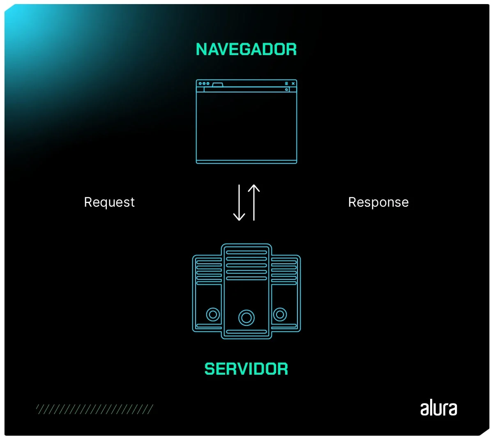

# HTTP: um guia completo sobre o que é e como funciona o protocolo da web


## O que significa HTTP?

A sigla **HTTP vem de Hypertext Transfer Protocol. Traduzido para o português, HTTP significa “Protocolo de Transferência de Hipertexto”**.

O termo “hipertexto” descreve um sistema de organização de informações em que documentos têm conexões clicáveis, permitindo aos usuários saltar de uma parte do texto para outra de maneira não linear.

Dessa forma, HTTP é um protocolo, uma forma de conversa entre duas máquinas, que permite transferir um hipertexto de um lado a outro. E aí está a razão do nome “Hyper Text Transport Protcolo”.

## O que é HTTP

Para começar, **HTTP, ou Hypertext Transfer Protocol, é um protocolo de comunicação utilizado para a transferência de informações na World Wide Web (WWW) e em outros sistemas de rede**.

O HTTP é a base para que o cliente e um servidor web troquem informações. Ele permite a requisição e a resposta de recursos, como imagens, arquivos e as próprias páginas webs que acessamos, por meio de mensagens padronizadas. Com ele, é possível que um estudante num café em São Paulo leia um artigo que está armazenado em um servidor no Japão.

Tá, mas por que eu preciso saber mais sobre HTTP?!

Entender bem o protocolo HTTP pode te ajudar a desenvolver melhores aplicações web e a debugá-las quando as coisas derem errado. Para compreender melhor o HTTP, é importante entender como o navegador web funciona.

A seguir, sugerimos um vídeo onde Sérgio Lopes explica o que acontece por baixo dos panos dos browsers mais usados como Google Chrome, Safari, Firefox e outros:

- [Como funcionam os navegadores Web?](https://www.youtube.com/watch?v=kDy62zaCHZE)

## Qual é a origem do HTTP?

Para falar da origem do HTTP, vamos lá para a década de 1980, quando o britânico Tim Berners-Lee, cientista da computação, estava trabalhando na Organização Europeia para Pesquisa Nuclear (CERN).

Em 1989, Tim teve a ideia de um sistema global de compartilhamento de informações, pois percebeu a necessidade e buscava maneiras de facilitar a colaboração entre cientistas, pesquisadores e instituições de todo o mundo.

E assim foi criado o projeto “WorldWideWeb” em 1989. Já em 1990, Berners-Lee apresentou sua primeira proposta que seria reconhecida como o sistema de gerenciamento de informações baseado em hipertexto.

Essa proposta de um Protocolo de Transferência de Hipertexto trouxe a primeira versão, a 0.9, uma versão simples que permitia apenas solicitações GET, isso é, os clientes poderiam solicitar recuperação de uma página de um servidor. A resposta não trazia cabeçalhos, apenas o conteúdo HTML solicitado.


Tim Berners-Lee (Fonte: Wikimedia Commons)

Em 1996, uma evolução do HTTP ocorreu, incluindo agora o HTTP 1.1, dessa vez com cabeçalhos mais complexos, além da inclusão de métodos adicionais, entre eles, o POST.

No ano seguinte, em 1997, foi lançado o HTTP 1.1, apresentando aprimoramentos significativos. Uma das mudanças chave foi a introdução da persistência de conexão, uma funcionalidade que reduz a latência (tempo de espera entre o envio de uma solicitação e o início da recepção da resposta) ao permitir que múltiplas solicitações e respostas sejam enviadas pela mesma conexão, evitando a necessidade de abrir uma nova conexão para cada recurso.

A versão 2.0 do HTTP, lançada em 2015, trouxe melhorias notáveis na transferência de dados entre clientes e servidores. Introduzindo a multiplexação para transmissão simultânea, a compactação de cabeçalhos em formato binário e recursos como priorização de fluxo e push do servidor, o HTTP 2 aumentou a eficiência, reduziu a latência e proporcionou uma experiência de navegação mais rápida.

A versão atual, HTTP 3, foi lançada em 2018 em resposta à demanda por maior eficiência e desempenho, adotando o protocolo QUIC. Essa evolução, somada a características mantidas das versões anteriores, reforçou ainda mais a eficiência na entrega de conteúdo online.

## Como funciona o HTTP?

O HTTP opera em um modelo cliente-servidor, em que um cliente, geralmente um navegador web, faz solicitações a um servidor para obter recursos, como páginas da web, imagens ou arquivos.

### O ciclo se inicia quando:

1. o cliente estabelece contato com o servidor, encaminhando uma requisição HTTP;

2. Nessa solicitação, o cliente especifica o método pretendido (por exemplo, GET para obter informações) e o caminho do recurso desejado;

3. Ao receber essa requisição, o servidor a processa e responde com uma mensagem HTTP, incluindo o recurso requisitado e informações adicionais no cabeçalho da resposta.

E toda essa interação acontece por meio do protocolo TCP (Transmission Control Protocol), que garante uma comunicação confiável e orientada à conexão.

Cada requisição do cliente é tratada de forma independente, isto é, as requisições não necessitam de informações sobre requisições anteriores para serem executadas.

Sem a necessidade de gerir o estado entre as requisições, o protocolo mantém uma certa simplicidade, promovendo também uma escalabilidade maior.

Contudo, para abordar a demanda de manter estados em determinadas aplicações web, são comumente empregados mecanismos suplementares, tais como cookies e sessões.

Resumindo de forma geral, HTTP é o protocolo que clientes e servidores utilizam para se comunicar e, inclusive, é o protocolo mais utilizado para aplicações e APIs da web.



## Infraestrutura de Comunicação HTTP

Sistemas baseados em HTTP envolvem interações entre clientes, servidores e proxies para facilitar a comunicação na web.

### Cliente

O termo "cliente" refere-se ao dispositivo ou software que age em nome do usuário para interagir com os recursos na web. Isso inclui navegadores da web, aplicativos móveis, scripts automatizados, ou qualquer outra entidade que envia solicitações HTTP para acessar informações ou serviços em servidores web.

O cliente inicia solicitações HTTP para acessar recursos na web. Normalmente é um navegador da web, mas também pode ser um aplicativo móvel, software de automação, ou qualquer entidade que faça pedidos de informações a servidores, fazendo requisições para os servidores e recebendo as respostas correspondentes.

### Servidor

O servidor é o dispositivo que hospeda e fornece os recursos solicitados pelos cliente, ele pode ser apenas uma máquina ou até mesmo várias máquinas que operam juntas. O servidor processa as requisições recebidas, executa a lógica necessária e retorna as respostas adequadas, geralmente páginas web, imagens ou outros tipos de dados.

A introdução do cabeçalho Host no HTTP 1.1 foi crucial para permitir que vários servidores compartilhassem o mesmo endereço IP, facilitando a hospedagem de múltiplos sites em um único servidor.

### Proxies

Os proxies, conhecidos também como “representantes”, atuam como intermediários entre clientes e servidores, facilitando o fluxo de tráfego de dados entre eles.

Podemos citar dois tipos existentes de proxies, o forward proxy que fica entre o cliente e o servidor, agindo em nome dos clientes para buscar recursos dos servidores; e o reverse proxy, posicionado entre clientes e servidores, mas operando em nome dos servidores para receber solicitações dos clientes.

Além de otimizar o tráfego e melhorar a eficiência da rede, muitos proxies implementam mecanismos de cache para armazenar localmente recursos frequentemente solicitados, reduzindo a carga nos servidores.

Esses intermediários também oferecem benefícios em termos de segurança, permitindo anonimato na web, filtragem de conteúdo malicioso e controle de acesso.

Adicionalmente, proxies podem realizar balanceamento de carga entre servidores, acelerar o carregamento de páginas por meio da compressão de dados, e fornecer logging e monitoramento para análise de padrões de uso e garantia de conformidade com políticas de segurança.

## Aspectos fundamentais do HTTP na comunicação entre clientes e servidores web

- **Métodos HTTP** O HTTP utiliza métodos, como GET, POST, PUT e DELETE, para indicar a ação desejada na solicitação. Esses métodos definem operações comuns, como obter dados, enviar dados para processamento, atualizar ou excluir recursos.

- **Headers (Cabeçalhos)** Os cabeçalhos HTTP contêm informações adicionais sobre a requisição ou a resposta. Eles incluem dados como o tipo de conteúdo, a data da requisição, cookies, e muitos outros.

- **URI (Uniform Resource Identifier)** Os recursos na web são identificados por URLs (Uniform Resource Locators) ou URIs. Uma URI é uma sequência de caracteres que identifica um nome ou um recurso na web.

- **Cache** O HTTP possui mecanismos de cache para melhorar o desempenho. Os cabeçalhos de controle de cache indicam se o navegador do cliente ou intermediários podem armazenar em cache uma resposta HTTP e, caso possível, por quanto tempo e em quais condições.

- **Tipo de hipermídia**
O tipo de hipermídia comum no contexto do HTTP é o HTML, utilizado para criar e apresentar documentos na web. Porém, o HTTP suporta uma variedade de tipos de mídia, como XML, JSON, imagens e vídeos, permitindo a transmissão de diversos tipos de dados online.

## Fluxo HTTP

Para entendermos de forma mais prática o funcionamento de um site — que necessita de diversas etapas — vamos ver como esse processo ocorre:

1. Uma pessoa acessa um site, estabelecendo uma conexão.
2. Se a URL pertencer a um domínio próprio, o navegador inicia conectando-se a um servidor e recuperando o endereço IP correspondente ao servidor associado ao domínio.

3. O navegador envia uma solicitação HTTP para a página desejada.

4. O servidor recebe essa solicitação, busca a página e ao encontrar envia de volta ao navegador. Caso não encontre, o servidor responde com um erro HTTP 404 (Você pode já ter visto esse número por ai! Agora você sabe o que ocorreu por baixo dos panos)

5. O navegador recebe a página enviada pelo servidor, e em seguida, encerra a conexão estabelecida.

6. Agora o navegador irá analisar o conteúdo e buscar todos elementos necessários para completar a exibição. Se existir necessidade de elementos complementares, o navegador realizará conexões adicionais e envia mais solicitações de protocolo ao servidor.

7. E por último, a página é finalmente carregada por completo no navegador, que é quando conseguir visualizar e acessar os sites!

## O processo Request-Response

Uma mensagem de requisição é enviada por um cliente a um servidor para solicitar algum tipo de ação ou recurso.

Aqui estão os componentes principais de uma requisição HTTP:

## Linha de Solicitação (Request Line):

Na linha de solicitação, presente em uma solicitação HTTP, são especificados três elementos principais: o método HTTP, a URI (Uniform Resource Identifier) e a versão do protocolo HTTP.

Exemplo de linha de solicitação:

`GET /exemplo/recurso HTTP/1.1`

Neste exemplo, "GET" é o método HTTP, "/exemplo/recurso" é a URI, e "HTTP/1.1" é a versão do protocolo.

Uma mensagem inteira de requisição HTTP do servidor poderia se parecer com isto:

```
GET / HTTP/1.1
Host: www.meusite.com.br
User-Agent: Mozilla/5.0 (Windows NT 10.0; Win64; x64) AppleWebKit/537.36 (KHTML, like Gecko) Chrome/58.0.3029.110 Safari/537.3
Accept: */*
Accept-Language: en-US,en;q=0.5
Accept-Encoding: gzip, deflate
Connection: keep-alive
```

Os cabeçalhos seguintes (como Host, User-Agent, Accept, etc) fornecem informações adicionais sobre o navegador do cliente e as preferências de conteúdo.

## Linha de Status (Status Line):

Na linha de status, presente em uma resposta HTTP, são fornecidos três elementos principais: a versão do protocolo HTTP, um código de status e uma mensagem de status.

O site a seguir, dá o status possíveis de comunicação HTTP:
- [http.cats](https://http.cat/)

Exemplo de linha de status:

`HTTP/1.1 200 OK`

Neste exemplo, "HTTP/1.1" é a versão do protocolo, "200" é o código de status indicando sucesso, e "OK" é a mensagem de status associada.

Uma mensagem inteira de resposta HTTP do servidor poderia se parecer com isto:

```
HTTP/1.1 200 OK
Date: Sun, 09 Apr 2023 12:28:53 GMT
Server: Apache/2.4.18 (Ubuntu)
Last-Modified: Sat, 08 Apr 2023 23:11:04 GMT
Content-Length: 612
Content-Type: text/html; charset=UTF-8
Connection: closed

<html>
<head>
<title>Exemplo de Site</title>
</head>
<body>
<h1>Olá, Mundo!</h1>
<p>Este é um exemplo de corpo de resposta HTTP.</p>
</body>
</html>
```

Os cabeçalhos de resposta, como Date, Server, Last-Modified, fornecem informações sobre o servidor e o recurso enviado, como por exemplo o Content-Type, que informa para o navegador o formato do corpo da resposta (conhecido também como response body) , no nosso aqui do exemplo, um simples documento HTML, e o corpo da resposta que contém o conteúdo solicitado.

A linha de solicitação informa ao servidor qual ação o cliente deseja realizar, enquanto a linha de status na resposta indica o resultado da solicitação, seja ele um sucesso, um redirecionamento ou um erro específico.

Essa estrutura padronizada facilita a interoperabilidade entre diferentes sistemas web.

Mas… Vamos resumir tudo isso em um exemplo:

Se você me pergunta: **Qual a próxima formação da Alura?**

Para que eu possa responder essa pergunta corretamente, são necessárias algumas coisas:

- Eu preciso entender a sua pergunta. Se você me perguntar em um idioma que não conheço, provavelmente não conseguirei te dar uma resposta;
- Preciso de acesso a algum lugar que conste as próximas formações da Alura.

O HTTP funciona mais ou menos desta mesma forma: um cliente precisa de um recurso que está em outro computador.

Então, o cliente faz uma requisição (HTTP request) para um servidor usando uma linguagem e vocabulário que espera que o servidor consiga entender.

Se o servidor conseguir entender sua requisição e tiver o recurso disponível, ele irá responder com uma resposta(response).

Caso o servidor entenda a requisição, mas não tenha o recurso, provavelmente ele vai responder que não tem. Caso ele não entenda a requisição, você pode não ter resposta.

Request e Response são dois tipos de mensagem diferentes quando falamos de HTTP. A especificação HTTP diz exatamente o que podemos colocar dentro de cada um destes tipos de mensagem para que todos que "falem" o idioma HTTP, e consigam trocar informações corretamente.

Uma requisição HTTP tem o seguinte formato:

E uma resposta HTTP:


Então, resumidamente, não existe nada mágico quando você digita um endereço no navegador: ele abre uma conexão com o servidor em questão e envia para ele um monte de texto seguindo regrinhas especificadas pelo protocolo.

Para visualizar as linhas de solicitação (Request Line) e de status (Status Line) de uma requisição HTTP, você pode usar ferramentas de desenvolvedor embutidas em navegadores da web ou aplicativos específicos:

1. Abra o site desejado no Chrome.
2. Pressione Ctrl + Shift +I ou clique com o botão direito na página e selecione “Inspecionar”.
3. Navegue até a guia “Rede”.
4. Você pode atualizar a página utilizando a tecla F5 para capturar solicitações recentes.
5. Clique em uma solicitação na lista, depois navegue até a seção “Cabeçalhos” para ver detalhes.


## Métodos

### GET

O método GET é usado para solicitar dados de um recurso específico. É possível utilizar para recuperar informações, como as páginas web, através de um servidor.

Embora seja possível incluir um corpo na mensagem, na prática ele geralmente não é utilizado para isso, sendo mais comum seu uso para passar parâmetros na URL. Headers também podem ser incluídos na solicitação GET, e são frequentemente utilizados para fornecer informações adicionais ao servidor, como informações de autenticação ou preferências de conteúdo. No entanto, o uso de headers em solicitações GET é mais comum em casos específicos, como quando se precisa controlar o cache ou fornecer informações de autenticação.

### HEAD

O HEAD é semelhante ao GET, e é usado para obter informações sobre um recurso, mas apenas os cabeçalhos da resposta, sem o corpo. É útil para obter metadados sem carregar o conteúdo completo do recurso.

### POST

O método POST é utilizado para enviar dados ao servidor para processamento. É comumente usado para enviar informações de formulário ou para realizar a criação de recursos no servidor.

### PUT

O método PUT é usado para enviar dados ao servidor para criar ou atualizar um recurso específico na localização especificada pelo URI. Ele substitui completamente o recurso existente.

### DELETE

O método DELETE é utilizado para solicitar a remoção de um recurso específico no servidor. Após uma solicitação DELETE bem-sucedida, o recurso deve ser removido ou tornar-se inacessível, é recomendado o uso de um parâmetro na URL para que evite problemas como a remoção de mais de um arquivo ao mesmo tempo.

### TRACE

O método TRACE é geralmente usado para fins de diagnóstico, como se fosse uma ferramenta de debug. Quando um servidor recebe uma solicitação TRACE, ele reflete a solicitação de volta ao cliente, permitindo que o cliente veja quais alterações foram feitas no caminho durante o percurso até o servidor.

### OPTIONS

O método OPTIONS é usado para obter as opções de comunicação permitidas para um recurso ou servidor. Isso pode incluir métodos permitidos, cabeçalhos aceitáveis, entre outras informações relevantes.

### CONNECT

O método CONNECT é usado para estabelecer uma conexão de túnel com o servidor, geralmente para comunicações seguras através de um proxy HTTP. Ele é usado principalmente para estabelecer conexões SSL/TLS para comunicações seguras.

## Qual é a diferença entre HTTP e HTTPS?

Compreendemos que o HTTP é um protocolo de comunicação entre cliente e servidor. Mas, você também já pode ter visto em algum site HTTPS, ao invés de HTTP. Afinal, qual a diferença?


Exemplo de uso do HTTPS no site da Alura.
A sigla HTTPS vem de Hypertext Transfer Protocol Secure, ou Protocolo de Transferência de Hipertexto Seguro. Como o próprio nome já sugere, o HTTPS é uma versão mais segura do HTTP.

O HTTP transmite dados sem criptografia, o que pode torná-los mais suscetíveis a ameaças de terceiros. Já o HTTPS, utiliza uma criptografía SSL/TLS para proteger a integridade de dados, ou seja, se alguém conseguir interromper de alguma forma a comunicação, os dados estão protegidos por uma criptografia.

O HTTPS é crucial para transações online e o manuseio de dados sensíveis, oferecendo uma camada extra de segurança HTTP.

### Conclusão

Desde sua concepção por Tim Berners-Lee na década de 1980, o HTTP evoluiu por meio de diferentes versões, como 1.1, 2.0 e 3.0, buscando melhorias em eficiência e segurança.

Operando no modelo cliente-servidor, o HTTP utiliza métodos, cabeçalhos e URIs para estruturar solicitações e respostas, garantindo uma comunicação padronizada.

A introdução do HTTPS acrescentou uma camada de segurança, implementando criptografía SSL/TLS para proteger dados sensíveis.

Sistemas baseados em HTTP envolvem interações entre clientes, servidores e proxies, otimizando o tráfego e proporcionando benefícios em termos de segurança.

Compreender o HTTP é crucial para desenvolvedores web, permitindo a criação de aplicações eficientes e seguras, contribuindo para uma experiência de navegação online mais confiável e protegida.

O protocolo, em constante evolução, continua a desempenhar um papel central na arquitetura da web, impulsionando a troca de informações e a interconexão global de sistemas digitais.

- ### [Artigo de Akemi Alice para a ALURA](https://www.alura.com.br/artigos/http)

### [Menu Criando e Estruturando sua Primeira API com GET e Banco de Dados](menu.md)
