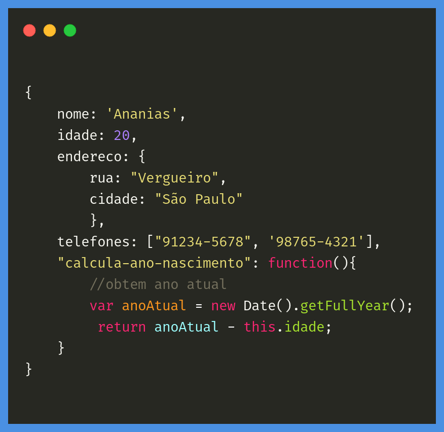

# JSON e Objeto JavaScript são a mesma coisa?

- ### [Artigo de Akemi Alice para a ALURA](https://www.alura.com.br/artigos/http)



Já criou algum objeto próprio em Javascript? Tipo:

```
{ 
    nome: 'Ananias', 
    idade: 20, 
    endereco: { 
        rua: "Vergueiro", 
        cidade: "São Paulo"
        }, 
    telefones: ["91234-5678", '98765-4321'],
    "calcula-ano-nascimento": function(){ 
        //obtem ano atual 
        var anoAtual = new Date().getFullYear();
         return anoAtual - this.idade; 
    } 
}
```

O objeto anterior tem várias propriedades: `nome` é uma **string**, `idade` é um **number**, `endereco` é um outro objeto com suas propriedades, `telefones` é um array e `calcula-ano-nascimento` é uma **function**. Tudo bonito!

Mas esse objeto é um JSON?

A sigla JSON significa **JavaScript Object Notation ou Notação de Objetos** **JavaScript**, em inglês. Pelo nome da coisa, parece que sim...

Parece mas **não é**. Um JSON é um formato de transferência de dados muito usado em chamadas AJAX entre o navegador e um servidor. Você está interessado nos dados, apenas nos dados...

### Um JSON tem algumas restrições:

- não pode ter funções
- não pode ter comentários
- todo texto sempre tem aspas duplas
- as propriedades sempre tem aspas duplas

Aquele objeto é um JSON? Não, porque viola alguma dessas restrições. Estamos interessados só em dados, afinal de contas. Teríamos que tirar a function, os comentários e colocar aspas duplas.

### O JSON baseado naquele objeto seria:

```
{ 
    "nome":"Ananias",
    "idade":20,
    "endereco": { 
        "rua":"Vergueiro",
        "cidade":"São Paulo" 
    }, 
    "telefones": ["91234-5678", "98765-4321"]
}
```

Portanto, um JSON é mais restrito que um objeto JavaScript.

### [Menu Criando e Estruturando sua Primeira API com GET e Banco de Dados](menu.md)

