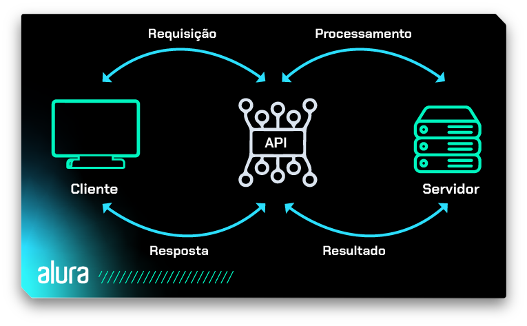
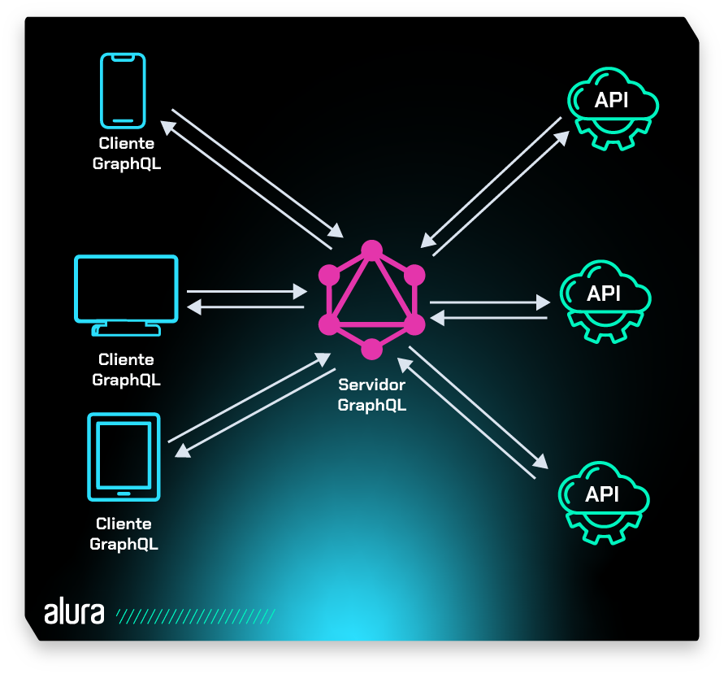
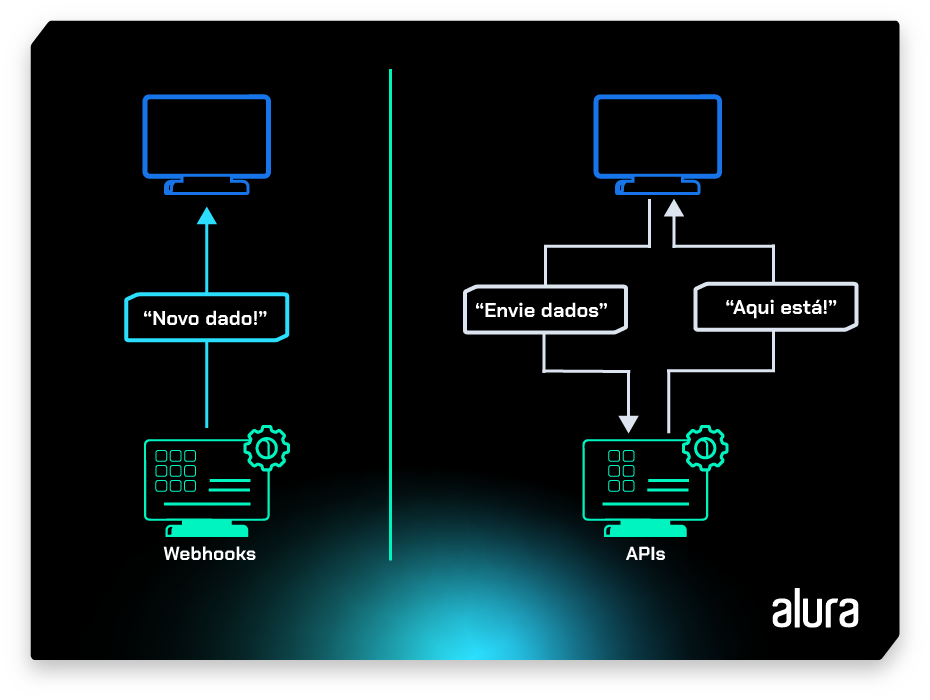

# API: o que é, para quê serve e qual é a sua importância

Imagine um restaurante em que o cliente quer fazer seus pedidos com base no que está no cardápio. Mas ele não pode pedir diretamente para o chef de cozinha.

Então, ele interage com o garçom, que é a pessoa que envia as solicitações para a cozinha, para que possam começar a preparar os pedidos.

Assim que o prato estiver pronto, o garçom será responsável por encaminhá-lo até a mesa do cliente, tudo isso de forma organizada.

Essa dinâmica entre cliente, garçom e cozinha reflete o **relacionamento essencial em uma API**.

Esse relacionamento também define como diferentes componentes de software devem interagir, facilitando a integração entre sistemas e aplicativos, o que pode ser utilizado para diferentes propósitos.

Esse foi só o exemplo aproximado do que seriam as APIs, mas ainda não sabemos o que elas realmente significam, bora entender isso?

## O que significa API?

API é um acrônimo em inglês para Application Programming Interface. Em português, significa Interface de Programação de Aplicações.

De forma geral, é um conjunto de padrões, ferramentas e protocolos que permite a criação mais simplificada e segura de plataformas, pois permite a integração e a comunicação de softwares e seus componentes.

Ao longo do artigo, vamos discutir o que são APIs de forma mais aprofundada, vamos lá?

## Como funciona uma API?

As APIs desempenham um papel de conectividade e interação entre diferentes sistemas e aplicações. Existem vários tipos de APIs, cada um servindo a propósitos específicos. Vamos explorar alguns desses tipos?

## APIs baseadas em Web

**A API baseadas em Web Serve como uma ponte eficaz entre o cliente e o servidor**. Para isso, utiliza protocolos da web, como HTTP.

Assim, permite a comunicação entre sistemas pela internet e, consequentemente, que aplicações diferentes interajam e compartilhem dados de forma padronizada, independentemente da tecnologia utilizada em cada extremidade.

Seu funcionamento acontece da seguinte forma:

- O servidor aguarda por requisições.
- O cliente envia uma requisição HTTP para o endpoint adequado no servidor (por exemplo, GET /tasks ou POST /tasks).
- O servidor processa a requisição, realiza as operações necessárias (obter ou adicionar tarefas) e retorna uma resposta ao cliente, geralmente em formato JSON.
- O cliente recebe a resposta e pode então processar os dados conforme necessário.



## APIs de biblioteca (Library APIs)

**As APIs de biblioteca são conjuntos de funções, procedimentos, classes ou módulos que podem ser incorporados diretamente no código de outros projetos** para facilitar tarefas específicas ou oferecer novas funcionalidades.

A ideia é que essas APIs sejam reutilizáveis e simplifiquem a implementação de operações, proporcionando uma abstração eficiente para o processo de desenvolvimento.

Um exemplo desse tipo de API é o **Matplotlib** em Python, que facilita a criação de gráficos e visualizações.

Podemos citar também a biblioteca *requests*, frequentemente usada para fazer requisições HTTP de maneira simplificada.

A pessoa desenvolvedora inclui a biblioteca em seu projeto e utiliza métodos como *get* ou *post* para realizar requisições HTTP sem precisar se preocupar com a complexidade subjacente da comunicação pela rede.

## APIs de Sistema Operacional (OS APIs)

As APIs do Sistema Operacional permitem que programas de software interajam com o sistema operacional subjacente, acessando recursos e serviços específicos do sistema.

Elas fornecem uma interface padronizada para que as aplicações possam realizar operações como manipulação de arquivos, comunicação com dispositivos de hardware, gerenciamento de memória e execução de processos.

A **WinAPI (Windows API)** é uma extensa coleção de interfaces de programação que permite interagir com o sistema operacional Windows, pois se trata de um conjunto robusto de ferramentas que abrange uma variedade de funcionalidades, desde manipulação de janelas até manipulação de arquivos, acesso a recursos do sistema e muito mais.

Essa API é um exemplo significativo de como as APIs de Sistema Operacional facilitam a interação entre aplicações e o sistema operacional em ambientes Windows.

## APIs de Banco de Dados

As APIs de Banco de Dados permitem que aplicações interajam com sistemas de gerenciamento de bancos de dados (SGBDs), realizando operações como consulta, inserção, atualização e exclusão de dados.

Elas fornecem uma interface padronizada para haver comunicação eficiente com diferentes tipos de bancos de dados, como MySQL, PostgreSQL, Oracle, SQLite, entre outros.

A SQLAlchemy é uma popular API de Banco de Dados em Python que oferece uma abstração de nível mais alto, facilitando a interação com diferentes SGBDs.

## APIs de Hardware

As APIs de Hardware fornecem uma interface padronizada para que o software interaja com os componentes físicos de um sistema, como processadores, placas gráficas, dispositivos de armazenamento, periféricos e outros elementos de hardware.

Essas APIs permitem a quem desenvolve acessar e controlar funcionalidades específicas do hardware sem a necessidade de conhecer detalhes de baixo nível.

A **OpenGL** é uma API de gráficos de hardware que possibilita a criação eficiente de gráficos tridimensionais, abstraindo a complexidade dos detalhes específicos da placa gráfica subjacente.

Outro exemplo de API de hardware comumente utilizada é a **DirectX**, desenvolvida pela Microsoft, especialmente para sistemas Windows. A DirectX oferece uma série de APIs para interagir com hardware de áudio, vídeo e entrada.

## APIs Sociais

Permitem que pessoas desenvolvedoras integrem funcionalidades ou dados de plataformas de mídia social em suas próprias aplicações, sites ou serviços. Essas APIs possibilitam a interação com recursos oferecidos por redes sociais, como o acesso a perfis de usuários, postagens, compartilhamento de conteúdo, autenticação de usuários, entre outros.

### Exemplos de APIs sociais incluem:

- **Facebook Graph API**: permite que quem desenvolve acesse e interaja com dados do Facebook, como informações de perfil, postagens, fotos e eventos.

- **Twitter API**: possibilita a integração de funcionalidades relacionadas ao Twitter, como a postagem de tweets, a leitura de fluxos de tweets e a obtenção de informações sobre usuários e tendências.

- **Instagram Graph API**: oferece acesso a dados do Instagram, permitindo que pessoas desenvolvedoras exibam fotos, informações de perfil e interajam com conteúdo na plataforma.

- **LinkedIn API**: permite a integração com dados e recursos do LinkedIn, como perfis de usuário, postagens e conexões profissionais.

## APIs de Serviços em Nuvem

As APIs de serviços em nuvem proporcionam uma interface padronizada para interação com serviços e recursos hospedados em plataformas de computação em nuvem.

Com elas podemos acessar e gerenciar serviços, como armazenamento de dados, computação, aprendizado de máquina, análise de dados, entre outros, fornecidos por provedores de nuvem como Amazon Web Services (AWS), Microsoft Azure, Google Cloud Platform (GCP) e outros.

Ufa! Quanta coisa!

De modo geral as funções básicas de uma API são: **obter a informação, enviá-la, alterá-la e excluí-la**. Para fazer isso, o aplicativo do usuário envia uma solicitação para um aplicativo de terceiros, que gera uma resposta.

Imagine que você compra um ingresso de cinema online ou pede um táxi por meio de um aplicativo. Durante a transação, o terminal acessa a API do banco emissor do cartão e envia uma solicitação de pagamento. Seu aplicativo, aquele que envia a solicitação, é chamado de **cliente** e aquele que retorna a resposta é conhecido como **servidor**.

### A interação por meio de uma API é feita em três etapas:

- O cliente faz uma chamada de API, ou seja, envia uma solicitação para extrair informação de um programa externo ou de um servidor web.
- O servidor envia uma resposta para a API com os dados solicitados.
- A API transfere esses dados para o cliente, que pode aplicá-los de maneira segura.

## Para que serve uma API?

**A função principal de uma API é garantir que sistemas com linguagens diferentes possam se integrar de maneira ágil e segura**.

Por isso, as APIs são utilizadas por negócios de tecnologia que trabalham com softwares, permitindo a integração entre seus próprios sistemas e os produtos de outras empresas.

Isso traz uma melhoria significativa para a experiência do usuário, que consegue acessar dados e informações diretamente na plataforma de sua preferência.

A API também simplifica o trabalho de quem desenvolve, pois com seu uso é possível utilizar códigos já desenvolvidos anteriormente por outras pessoas e aplicá-los em novos programas para resolver problemas comuns em programação.

Isso facilita a criação de novos aplicativos, softwares e plataformas em geral, diminuindo tempo e esforço.

## Por que usar API?

Além de possibilitar a conexão de diferentes aplicações, facilitando a vida de usuários, as APIs trazem mais agilidade e praticidade para uma série de processos.

Tanto para a integração entre banco de dados ou para a troca de informações entre um ERP e outras plataformas, por exemplo.

A segurança de dados é outro importante benefício das APIs, uma vez que elas são capazes de bloquear acessos e permissões a informações de softwares e hardwares, algo que nem sempre outras aplicações conseguem.

## Quais são as vantagens de usar uma API?

As APIs desempenham diversos papéis e oferecem vários benefícios, incluindo:

- **Interoperabilidade**: permitem que diferentes sistemas, plataformas e aplicativos se comuniquem entre si de maneira padronizada, facilitando a integração de componentes de software distintos.

- **Acesso a funcionalidades**: uma API permite que pessoas desenvolvedoras acessem e utilizem as funcionalidades específicas de um software sem precisar entender os detalhes internos dele. Dessa forma podemos criar aplicações mais complexas, que se beneficiem das capacidades de vários serviços.

- **Reutilização de código**: ao oferecer uma interface para funcionalidades específicas, uma API permite que o código seja reutilizado em diferentes contextos. Isso reduz a redundância e melhora a eficiência do desenvolvimento.

- **Desenvolvimento rápido**: em vez de construir uma aplicação do zero, quem desenvolve pode utilizar APIs para incorporar funcionalidades já existentes, economizando tempo e recursos.

- **Integração de serviços**: APIs são frequentemente usadas para integrar serviços de terceiros em uma aplicação. Por exemplo, o login de uma aplicação pode ser terceirizado para um serviço de autenticação via API.

- **Distribuição de dados**: APIs permitem que dados sejam compartilhados entre diferentes sistemas. Isso é especialmente útil em ambientes nos quais diferentes partes precisam acessar e atualizar informações.

- **Atualização independente**: permite que partes do software sejam atualizadas independentemente umas das outras, desde que a interface da API permaneça consistente. Isso facilita a manutenção e evolução contínua de sistemas complexos.

- **Economia de recursos**: pessoas desenvolvedoras podem utilizar APIs para alavancar serviços e recursos já existentes, evitando a necessidade de reinventar a roda e economizando recursos de desenvolvimento.

## APIs e inovação

Ao possibilitar o acesso a recursos externos, como autenticação, pagamento online e outras funcionalidades, as APIs permitem que as pessoas desenvolvedoras criem soluções inovadoras, sem ter que construir tudo internamente.

Além disso, a modularidade proporcionada por APIs torna um sistema capaz de maior escalabilidade e atualização, independentemente de suas diferentes partes, promovendo a evolução contínua e ágil de aplicações.

## APIs remotas ou APIs Web

### APIs remotas

No mundo do desenvolvimento de software, é comum que sistemas distribuídos precisem se comunicar para compartilhar informações.

Neste contexto, surgiu a necessidade de estabelecer padrões que facilitassem a comunicação entre sistemas. E para isso, surgiram as APIs remotas, que se referem a interfaces para facilitar a interação entre sistemas por meio de protocolos.

Dentre os exemplos mais tradicionais de APIs remotas, destacam-se as APIs Web, SOAP (Simple Object Access Protocol) e REST (Representational State Transfer). Mais adiante, vamos explorar cada uma dessas abordagens.

### APIs Web

Considerando que as APIs remotas abrangem um conceito mais amplo, as APIs web se destacam como a comunicação específica realizada pela internet, utilizando os protocolos HTTP/HTTPS.

Esses protocolos estabelecem uma padronização para as mensagens de requisição e resposta. Em grande parte dos casos, essas mensagens são formatadas em XML (Extensible Markup Language) ou JSON (JavaScript Object Notation), como exemplificado abaixo:

### Estrutura de mensagens formatadas em JSON:

```
{
  "lista_pessoas":
  {
    "pessoas": [
      {
        "nome": "João Silva",
        "sexo": "M",
        "idade": "22"
      },
      {
        "nome": "Maria Eduarda",
        "sexo": "F",
        "idade": "21"
      },
      {
        "nome": "Pedro Gomes",
        "sexo": "M",
        "idade": "18"
      }
    ]
  }
}
```

### Estrutura de mensagens formatadas em XML:

```
<lista_pessoas>
  <pessoas>
    <nome>João Silva</nome>
    <sexo>M</sexo>
    <idade>22</idade>
  </pessoas>
  <pessoas>
    <nome>Maria Eduarda</nome>
    <sexo>F</sexo>
    <idade>21</idade>
  </pessoas>
  <pessoas>
    <nome>Pedro Gomes</nome>
    <sexo>M</sexo>
    <idade>18</idade>
  </pessoas>
</lista_pessoas>
```

Podemos observar que o formato XML utiliza tags para envolver os dados, tornando-o mais verboso e, por vezes, complexo.

Em contrapartida, o JSON é mais conciso, utiliza uma sintaxe baseada em pares chave-valor e é facilmente legível tanto para humanos quanto para máquinas.

Tanto XML quanto o formato JSON são utilizados para auxiliar na troca de mensagens em diferentes protocolos e arquiteturas. No contexto dessas comunicações, é relevante mencionar duas abordagens comuns: SOAP e REST.

## API SOAP e API REST

### API SOAP (Simple Object Access Protocol )

O SOAP é um protocolo de comunicação que serve para facilitar a troca de informações entre sistemas e aplicativos.

Por se tratar de um protocolo, ele estabelece um conjunto de convenções que definem a estrutura das mensagens e métodos que serão utilizados na comunicação entre os sistemas.

Ao adotar o SOAP, os envios e recebimentos de dados são encapsulados em documentos XML, proporcionando uma formatação consistente e padronizada. Este protocolo suporta a transmissão de requisições através de protocolos como HTTP e SMTP, permitindo uma grande possibilidade na integração entre sistemas.

A estrutura de uma mensagem SOAP pode ser definida da seguinte maneira:

- **Envelope**: é o elemento raiz que envolve toda a mensagem e traz dois filhos, Header (Cabeçalho) e Body (Corpo). O cabeçalho é um elemento opcional, enquanto o corpo é um elemento obrigatório.

- **Cabeçalho**: é um elemento usado para transmitir informações relacionadas a autenticação, identificação de transações e outros detalhes relevantes.

- **Corpo**: é um elemento que contém as informações específicas da operação ou serviço que serão transportadas entre os sistemas.

**As APIs construídas com SOAP geralmente são sistemas com requisitos e regulamentos rígidos de segurança**, pois ele oferece **suporte a WS-Security**, um conjunto de extensões que permite a integração de recursos de segurança, tais como autenticação, autorização, confidencialidade e integridade das mensagens trocadas entre os clientes e servidores web.

Alguns casos de uso comuns em APIs SOAP são: transações financeiras, reserva de viagens, serviços de saúde, integração de sistemas empresariais e etc.

## APIs REST (Representational State Transfer)

As APIs construídas com base na arquitetura REST **seguem um estilo que incorpora os princípios fundamentais da web**, visando o desenvolvimento de aplicações escaláveis e eficientes.

O formato JSON é comumente adotado para a transmissão de dados e as operações padrão do protocolo HTTP (GET, POST, PUT, PATCH e DELETE) são empregadas para realizar interações com os recursos.

As APIs REST podem ser desenvolvidas utilizando uma grande quantidade de linguagens de programação. No entanto, é crucial que essas APIs estejam alinhadas com os seis princípios de design REST a seguir:

1. **Interface uniforme**: possibilita a comunicação entre cliente e servidor de forma consistente, independentemente dos detalhes de arquitetura do backend. Essa interface deve oferecer um método padronizado de interação, por exemplo, HTTP com URIs, operações CRUD (Criar, Ler, Atualizar, Excluir) e o formato JSON.
2. **Separação cliente-servidor**: o cliente e o servidor devem ser completamente independentes um do outro, sendo a comunicação do cliente para o servidor realizada pela URI do recurso a ser solicitado.
3. **Sem estado definido**: a API não deve ter estado definido, o que significa que cada solicitação precisa incluir todas as informações necessárias para processá-lo.
4. **Capacidade de armazenamento em cache**: é recomendado que tanto o cliente quanto o servidor armazenem temporariamente recursos em cache. No contexto do servidor, quando um recurso é solicitado e há uma alta probabilidade de ser buscado novamente dentro de um período específico, é indicado que seja armazenado em cache para proporcionar respostas mais rápidas. Além disso, a resposta do servidor deve indicar se um recurso pode ser colocado em cache de forma local e segura no cliente.
5. **Arquitetura de sistema em camadas**: é recomendado estruturar o sistema em camadas, de modo que cada camada possui uma função específica. Essa abordagem ajuda a dividir o sistema em partes menores, facilitando a sua organização e tornando-o mais capaz de crescer conforme necessário.
6. **Código sob demanda**: é uma característica opcional que permite ao servidor enviar código executável (como applets Java ou scripts JavaScript) para ser executado pelo cliente, estendendo as capacidades do cliente de forma dinâmica.

## Diferenças entre API REST e API SOAP

API REST e API SOAP são duas formas para a transmissão de dados e para manter a interoperabilidade entre sistemas.

Vamos conhecer as principais diferenças entre eles?

- SOAP é um protocolo, enquanto o REST é um padrão de arquitetura;
- SOAP é independente de linguagem, transporte e até plataforma, enquanto o REST requer o uso do protocolo HTTP;
- SOAP é uma abordagem muito presente ainda em sistemas legados, enquanto REST surgiu posteriormente e costuma ser vista como uma solução mais eficiente em questão de performance nos casos bases em web;
- Para contextos mais leves como IoT (Internet das coisas), desenvolvimento de aplicações serverless e mobile é recomendado o REST, para sistemas que requerem mais segurança e muitas necessidades empresariais é recomendado o SOAP;
- O formato dos dados do SOAP é somente por meio de XML, enquanto o REST oferece suporte a XML, JSON, HTML e texto simples.

## GraphQL

As APIs que seguem o modelo REST, em grande parte impõem um modelo rígido de resposta de dados, ou seja, podem demandar transferências dispensáveis.

Isso refletirá na performance da aplicação, pois é comum essas APIs retornarem grande quantidade de dados que nem sempre são necessários.

Para contornar esse problema surgiu o GraphQL, uma linguagem de consulta para APIs com a qual clientes podem especificar as necessidades de dados de forma granular, otimizando a comunicação de requisição e resposta.

O GraphQL funciona como uma camada intermediária entre cliente e servidor, na qual cliente faz uma consulta da API GraphQL com uma solicitação de um dado específico e recebe apenas os dados necessários para a solicitação em vez de receber todo o conjunto de dados disponíveis no servidor.

Podemos conferir o processo na figura abaixo:



Um outro ponto importante a ser levado em consideração é que o GraphQL é compatível com todas as linguagens de programação mais usadas no mercado, o que o torna uma ferramenta versátil para atender uma ampla variedade de aplicativos.

Com relação à diferença entre as consultas de APIs GraphQL e API REST, vamos pensar no cenário de um e-commerce no qual usuários podem vender e comprar produtos.

Para obter dados de usuário, compras e vendas, de maneira geral pode-se considerar que a utilização do GraphQL é mais eficiente do que o padrão REST.

Repare nas consultas abaixo:

### Consultas a APIs GraphQL

```
query get_user {
  user(id: "4002") {
    name
    purchases { id }
    sales { id }
  }
}
```

### Consultas a APIs REST

```
GET /users/4002
```
```
GET /users/4002/purchases
```
```
GET /users/4002/sales
```

Veja que ao empregar o GraphQL, é possível obter todas as informações do usuário por meio de uma única consulta. Em contraste com o padrão tradicional REST, precisaríamos de três consultas distintas.

## APIs e webhooks

Os webhooks são uma alternativa de comunicação entre sistemas que permite que uma **aplicação A** seja notificada quando algum **evento** ocorrer na **aplicação B**.

Por exemplo, vamos imaginar um sistema de comércio eletrônico em que precisamos manter registros atualizados sempre que uma transação for concluída.

Em vez de verificar periodicamente o status das transações, vamos implementar um **webhook** para receber notificações automáticas quando uma compra for finalizada com sucesso.

Dessa forma, evitamos a necessidade de verificações contínuas e otimizamos a eficiência do sistema.

O processo de webhook envolve 3 partes principais:

- **O provedor**: a aplicação que enviará as notificações
- **O consumidor**: a aplicação que receberá as notificações
- **O próprio webhook**: ponto de integração entre os dois sistemas

No contexto do comércio eletrônico citado acima, quando um evento desencadeador (ou “gatilho”) ocorre na aplicação, como a mudança do status da compra, o provedor (sistema de comércio eletrônico) envia notificações para o consumidor, que pode ser representado por outras aplicações, como contabilidade ou gerenciamento de estoque.

Isso ocorre por meio de uma requisição HTTP contendo informações sobre o evento.

A diferença entre APIs e webhooks está na maneira como eles se comunicam entre sistemas. Por exemplo, com uma API REST, toda comunicação deve partir do lado cliente da requisição; ou seja, o servidor não pode enviar informações “proativamente”, sem serem solicitadas.

Já um webhook é desenhado para enviar dados automaticamente quando ações específicas acontecem (o que chamamos de “gatilhos”, como uma mudança num status de pagamento ou estoque), sem que a aplicação ou o cliente precisem solicitar.

Podemos conferir esta situação na imagem abaixo:



Em geral, podemos dizer que os webhooks são definidos como APIs reversas, pois permitem que um servidor envie dados quando necessário, em vez de o cliente enviar uma solicitação e aguardar ou verificar periodicamente.

## Políticas de lançamento de uma API

As políticas de lançamento de APIs referem-se às diretrizes e restrições estabelecidas pelas empresas para controlar o acesso e o uso de suas interfaces de programação de aplicativos (APIs).

Essas políticas são essenciais para determinar quem pode acessar uma API e como ela pode ser utilizada, seja para uso interno, por parceiros de negócios específicos ou pelo público.

Existem basicamente três tipos de políticas de lançamento de APIs:

- **Privada**: nesse caso, a API é restrita ao uso interno da empresa que a desenvolveu. Isso significa que apenas os funcionários da empresa têm acesso à API e podem utilizá-la para integrar diferentes sistemas e serviços dentro da organização.

- **Parceiro**: essa política de lançamento permite que apenas parceiros de negócios específicos tenham acesso à API. Um exemplo disso são empresas de transporte particular, como Uber e Lyft, que aprovam a permissão para pessoas desenvolvedoras terceirizadas solicitarem corridas diretamente de dentro de seus aplicativos. Dessa forma, as empresas controlam a qualidade das integrações, selecionando quais aplicativos têm acesso à API, ao mesmo tempo em que geram uma fonte adicional de receita.

- **Pública**: aqui a API está disponível para uso público, o que significa que qualquer pessoa ou empresa pode acessá-la e utilizá-la para desenvolver aplicativos e serviços. Um exemplo é a API do Twitter, em que é possível criar aplicativos que interagem com a plataforma de mídia social.

No entanto, nem todas as APIs públicas são acessíveis por todos. Algumas empresas, como provedores de serviços de Internet, usam APIs RESTful para permitir que clientes e revendedores acessem informações sobre sua infraestrutura, estatísticas de ataques DDoS, desempenho de rede, etc.

O acesso a essas APIs é concedido por meio de "tokens" de API ou validações de status do cliente.

Além desses três tipos de políticas de lançamento de APIs, também é importante mencionar a existência de APIs de código aberto.

Estas APIs são disponibilizadas com o código-fonte aberto, permitindo que desenvolvedores e comunidades contribuam, modifiquem e distribuam livremente. Isso promove a transparência, colaboração e inovação dentro da comunidade de desenvolvedores.

## Exemplos de API

As APIs estão presentes em todas as aplicações que usamos no dia a dia. Elas tornam possíveis os serviços online que nos auxiliam em tarefas, como obter localizações, descobrir informações climáticas, realizar pagamentos, rastrear encomendas, entre muitas outras funções.

## API de localização

Ao usar aplicativos de mapas ou serviços de entrega, estamos, na verdade, interagindo com APIs de localização. Por exemplo, a API do Google Maps permite que desenvolvedores utilizem funcionalidades de mapas em suas aplicações, proporcionando a usuários informações de navegação em tempo real e otimizando suas experiências de deslocamento.

## API de clima

Quando verificamos a previsão do tempo em nossos smartphones ou sites, estamos acessando uma API de clima. Um exemplo é a API da OpenWeatherMap, que fornece dados meteorológicos precisos e atualizados para desenvolvedores integrarem em suas aplicações.

Essa integração possibilita que usuários obtenham informações climáticas, como temperatura, umidade e previsões, melhorando a tomada de decisões relacionadas a suas atividades diárias.

## API de pagamentos

Quando realizamos pagamentos, seja através do Pix, cartão de crédito ou outras formas, muitas vezes utilizamos serviços externos integrados àquela aplicação. Um exemplo é a API de Pagamentos da PayPal,

Imagine só ter que desenvolver do zero um sistema de pagamentos? Utilizar alguma API de pagamentos em uma aplicação promove rapidez, confiança e segurança nas transações da aplicação, o que pode facilitar o pagamento para quem consome os produtos ao mesmo tempo que otimiza o trabalho de quem desenvolve a aplicação.

## Outros exemplos

Diversas grandes empresas possuem APIs públicas para utilizar seus serviços, aqui estão algumas delas para você explorar:

1. **YouTube Data API**: permite acessar e interagir com dados do YouTube, como vídeos, playlists, canais e comentários. Pessoas desenvolvedoras podem criar aplicativos que buscam vídeos populares, gerenciam playlists ou até mesmo publicam vídeos diretamente na plataforma. [Acesse o YouTube Data API](https://developers.google.com/youtube/v3?hl=pt-br)

2. **Amazon Web Services (AWS) API**: oferece acesso aos serviços em nuvem da Amazon, como armazenamento, computação, banco de dados e inteligência artificial. Desenvolvedores podem criar aplicativos que armazenam dados na nuvem, executam algoritmos de machine learning ou escalonam recursos de computação conforme necessário. [Acesse a Amazon Web Services (AWS) API](https://aws.amazon.com/pt/api-gateway/)

3. **Twitter API**: permite acessar e interagir com dados do Twitter, como tweets, seguidores e tendências. Permite criar aplicativos que monitoram hashtags populares, analisam a atividade dos usuários ou até mesmo publicam tweets automaticamente. [Acesse o Twitter API](https://developer.x.com/en/docs)

4. **GitHub API**: fornece acesso aos dados e funcionalidades da plataforma de hospedagem de código-fonte GitHub. Colabora para criar aplicativos que gerenciam repositórios de código, monitoram solicitações de pull ou automatizam processos de integração contínua. [Acesse o GitHub API](https://docs.github.com/en/rest?apiVersion=2022-11-28)

5. **Spotify Web API**: permite acesso aos dados e funcionalidades da plataforma de streaming de música Spotify. Com ele podemos criar aplicativos que acessam bibliotecas de música, recomendam playlists personalizadas com base no histórico de audição do usuário ou até mesmo controlam a reprodução de músicas diretamente do aplicativo. [Acesse o Spotify Web API](https://developer.spotify.com/documentation/web-api)

6. **Stripe API**: facilita a integração de pagamentos online em aplicativos e sites. Desenvolvedores podem criar aplicativos que aceitam pagamentos com cartão de crédito, gerenciam assinaturas de clientes ou processam reembolsos de forma automática. [Acesse o Stripe API](https://docs.stripe.com/api)

7. **Twilio API**: fornece ferramentas para comunicação em tempo real, como mensagens de texto, chamadas de voz e autenticação por SMS. Possibilita criar aplicativos que enviam mensagens de texto automáticas, realizam chamadas de voz programadas ou verificam a identidade dos usuários por meio de SMS. [Acesse o Twilio API](https://www.twilio.com/docs/usage/api)

8. **NASA API**: permite acessar e interagir com dados e imagens da NASA, como fotos do espaço, informações sobre missões espaciais e dados astronômicos. Útil para criar aplicativos que exibem imagens do espaço em tempo real, fornecem informações sobre o sistema solar ou até mesmo rastreiam a posição de satélites. [NASA API](https://api.nasa.gov/)

9. **Reddit API**: fornece acesso aos dados e funcionalidades da plataforma de fóruns online Reddit. Quem desenvolve pode criar aplicativos que buscam posts populares, analisam tendências de comunidades ou até mesmo automatizam o envio de mensagens. [Acesse o Reddit API](https://www.reddit.com/dev/api/)

## História das APIs

A história das APIs se iniciou nos anos 1960 e 1970, quando os computadores tornaram-se mais comuns e essenciais para diversas tarefas.

No entanto, tornou-se necessário encontrar uma maneira de reutilizar códigos para simplificar processos no desenvolvimento.

O termo "interface de programa de aplicação" foi introduzido pela primeira vez em 1968, em um artigo chamado "Estruturas e técnicas de dados para computação gráfica remota".

Os autores do artigo usaram o termo para descrever a interação de um aplicativo, neste caso um programa gráfico, com o restante do sistema de computador.

A intenção era criar uma interface de aplicação consistente para que as pessoas responsáveis pela programação não precisassem lidar com as particularidades do dispositivo de exibição gráfica e fornecer **independência de hardware**, permitindo que o computador ou a tela fossem substituídos sem impactar o funcionamento do aplicativo.

Logo, começaram a surgir alguns protocolos e padrões que serviram como base para as APIs. Por exemplo, na década de 1990 o **CGI (Common Gateway Interface)** se destacou como uma tecnologia que permitia aos servidores web acionarem scripts ou programas externos para gerar conteúdo dinâmico conforme a demanda. Isso facilitava a criação de páginas dinâmicas.

Ainda na década de 1990, surgiu o **protocolo SOAP** baseado em XML, possibilitando a comunicação entre sistemas distribuídos via web.

O SOAP forneceu uma maneira organizada para os aplicativos realizarem a troca de mensagens, padronizando a comunicação e regras de tratamento de erros.

Posteriormente nos anos 2000, Roy Fielding publicou sua tese de doutorado que aborda a introdução sobre Transferência de Estado Representacional (REST). Essa foi uma grande contribuição, pois o padrão REST revolucionou a implementação dos serviços web.

A **API REST** rapidamente ganhou popularidade, e **métodos HTTP** como GET, POST, PUT e DELETE passaram a ser usados como uma forma padrão de interagir com serviços baseados na web.

É notável que os primeiros protocolos e padrões desenvolvidos serviram como base para as tecnologias que envolvem as APIs hoje em dia. As APIs continuam a evoluir com o mesmo propósito: permitir a facilidade na comunicação entre sistemas.

- ### [Ecossistema Node.js #HipstersPontoTube](https://www.youtube.com/watch?v=2hrIwQWx9w4&t=33s)

### [Menu Guia de Mergulho](menu.md)