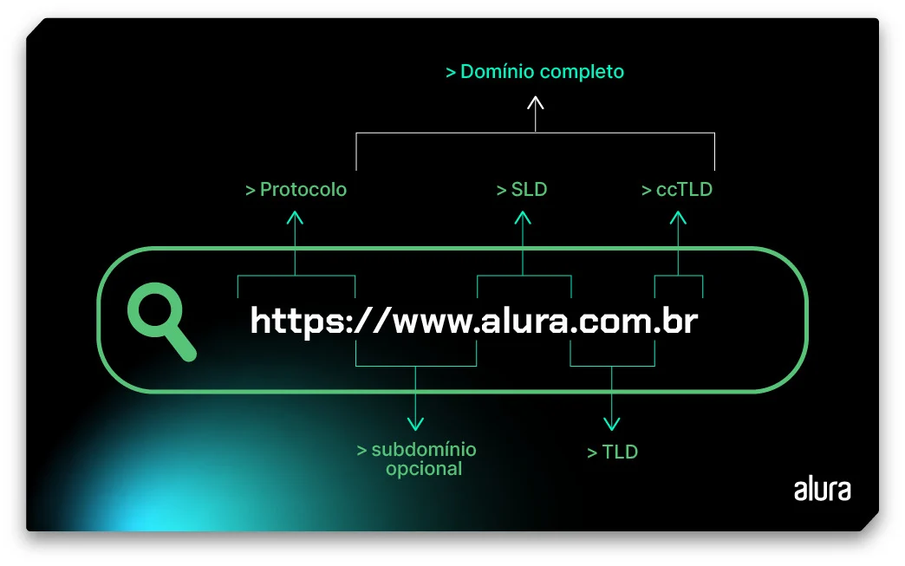
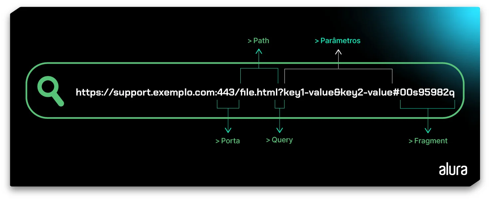
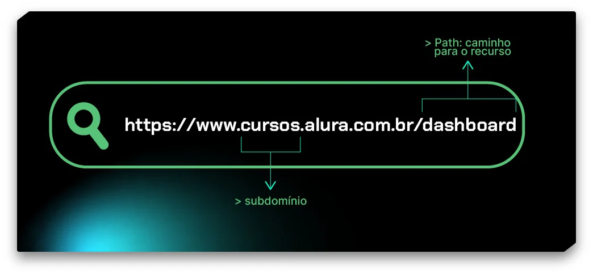

# Estrutura de uma URL

## Introdução

Todos os dias acessamos diferentes lugares na web, interagindo com sites, plataformas, redes sociais, aplicativos, dentre outros. Para cada um desses lugares utilizamos um nome específico no navegador. No entanto, como o computador sabe que aquele conjunto de letras representa um endereço?

Neste artigo, vamos desvendar o que são esses endereços que chamamos de URL, entendendo sua estrutura e a importância de criar uma URL bem estruturada para o seu site.

## O que é uma URL?

Imagine um mundo em que as pessoas não tivessem nomes e a única forma de identificá-las seria pelo CPF. Certamente isso mudaria bastante a nossa organização social e decorar a sequência de números seria bem mais complicado, não é verdade?

No universo web, ocorre algo bem parecido. Os sites, plataformas, blogs, etc possuem um endereço IP (Internet Protocol - Protocolo de Internet), formado por uma sequência de caracteres dividida estrategicamente em quatro grupos (chamados de octetos) que aponta para uma página web. O endereço IP também é usado para identificação de dispositivos conectados em uma rede e até mesmo das próprias redes (sim, a internet é um gigantesco entrelaçamento de muitas redes ao redor do mundo). Dessa forma, para acessar o site do Google, no lugar de `“www.google.com.br”`, teríamos que utilizar a sequência de números 142.250.191.67 no navegador. Pense só na possibilidade de ficar decorando endereços IP de sites, super complicado não é!?

Mas como o navegador entende que “google.com.br” corresponde ao endereço “142.250.191.67” e nos direciona corretamente para o site? Isso é possível graças a um sistema de mapeamento conhecido como **DNS (Domain Name System – Sistema de nome de domínio)**.

### Como essa identificação funciona?

Esse endereço amigável dos websites que inserimos no navegador é chamado de **URL**, um acrônimo para **Uniform Resource Locator** ( localizador padrão de recursos, em português). A URL é uma sequência única de caracteres utilizada para acessar recursos através da conversão por um sistema **DNS**.

O servidor **DNS** traduz o nome de um website que inserimos no navegador para o IP correspondente, ou seja, o endereço que os computadores entendem, e assim conseguimos acessá-lo!

Agora imagine outro cenário, em que a ordem de nome e sobrenome não importe e a identificação das pessoas seja feita com qualquer um de seus nomes. Certamente essa falta de padrão poderia gerar algumas confusões, a criação de uma árvore genealógica ficaria mais complexa e a própria forma de organização social talvez precisasse ser reestruturada.

Traga esse mesmo cenário para o mundo virtual… Ao contrário do nosso exemplo de mundo real, em que o Nome e Sobrenome nos ajudam a identificar e localizar pessoas, na web nós procuramos por **recursos**. Entende-se por recursos documentos, músicas, imagens, arquivos e etc. Na Alura, por exemplo, digitamos a URL "www.alura.com.br" no navegador para acessarmos os recursos disponíveis na plataforma.

Já pensou se para acessar a plataforma não houvesse a padronização da URL e as pessoas pudessem inserir *w.alurabr.com* ou *brAluracom.www* ou diferentes combinações no navegador?

Realmente, nada amigável! Além disso, provavelmente haveria a exigência de uma infraestrutura mais robusta para armazenar e processar todas essas formas de acesso, ou seja, os custos para manutenção de um website seriam maiores. Adicionando maior complexidade na manutenção e reparo das aplicações web.

Para organizar a casa, como tudo no universo da tecnologia, a URL atende a um padrão que é expresso em sua estrutura. E isso foi imaginado ainda em 1994, por **Tim Berners Lee no protocolo RFC 1738**, que padronizou a estrutura de uma URL tal qual conhecemos e usamos hoje.

## Vamos entender a anatomia de uma URL?

### Estrutura base de uma URL na web

Vamos começar a decomposição de uma URL comum, como a da plataforma da Alura:

Conseguimos notar que há um padrão na sequência de caracteres e cada parte da URL contém uma informação sobre o site, vamos analisar cada item:

## Protocolo de rede

A primeira parte da URL é o "https://", ou **Hyper Text Transfer Protocol Secure** indica o protocolo utilizado para a comunicação com a plataforma ou site, geralmente hospedados em um servidor. O HTTPS é muito utilizado devido à sua segurança e ao nível de criptografia feito através de um certificado SSL/TLS . Esse método dificulta o acesso às informações compartilhadas entre cliente e servidor.

Protocolos também são conhecidos como Scheme ou esquema e podem se apresentar de outras formas, como FTP (File Transfer Protocol), em que URLs que iniciam com "ftp://" são utilizadas para acessar servidores FTP e realizar transferência de arquivos.

Além desse tipo, existem URLs que começam com "ssh://", representando o protocolo SSH (Secure Shell). Esse protocolo é usado para acesso remoto a sistemas via SSH, geralmente para administração de servidores.

O importante é entender que cada protocolo possui um propósito específico e define como o recurso vinculado na URL deve ser acessado. A seleção e uso correto de um protocolo depende do tipo de serviço ou recurso ao qual você deseja se conectar ou acessar.

## Domínio completo

O domínio completo é o nome amigável que identifica o site, substituindo o uso do número IP para acessá-lo. No nosso caso, o domínio completo é **“www.alura.com.br”** e apresenta também algumas subdivisões.

### Subdomínio

**Sub-domain** ou subdomínio também são informações que especificam o tipo de conteúdo que o site hospeda. O *www* que significa *World wide web (ou rede mundial de computadores, em português)*, é um subdomínio **opcional** comum e voltado ao uso comercial. No entanto, se o site for um blog, você pode modificá-lo e utilizar o *blog*, como `blog.nomedoblog.com.br`.

Uma boa prática é separar o tipo de conteúdo que seu site oferece, como uma sessão de **suporte** , tal qual a da Alura, que você pode acessar via `https://suporte.alura.com.br/support/home`, repare que nesse caso ela possui o subdomínio `suporte`., assim conseguimos informar que aquele conteúdo é voltado para o suporte às pessoas usuárias.

Dessa forma, os subdomínios possibilitam a categorização de conteúdos de uma plataforma ou uma informação mais específica sobre determinada página web.

### SLD

No domínio completo, ao realizar sua aquisição, você adquire dois domínios: o de nível superior e o de segundo nível. O SLD, second-level domain, que em tradução é o domínio de segundo nível é o nome exclusivo da empresa ou companhia, em nosso exemplo é `alura`.

O SLD é uma das partes mais importantes de uma URL para quem acessa, pois é a partir desse nome específico que o seu site é identificado.

### TLD

Já o TLD, top-level domain, que em tradução livre é **domínio de nível superior** (também conhecido como extensão do domínio ou domínio de topo), indica o tipo de organização que o site ou plataforma representa. É o `.com`, `.org`, `.gov`, `.edu`.

Como podemos perceber, cada TLD também fornece informações sobre o site, indicando, por exemplo, se é uma companhia comercial, através do `.com`, ou uma instituição governamental com o `.gov`.

### ccTLD

O `.br` informa o país ou território. Em tradução é domínio de nível superior de código do país (country code top level domain).

A estrutura fundamental de uma URL web já possui diversos elementos. No entanto, uma URL também pode conter outras partes que carregam informações importantes. Vamos explorar esses componentes com mais detalhes?

## Estrutura de uma URL complexa

A URL também pode apresentar outros elementos para o acesso a recursos, confira na imagem abaixo:

Fonte: CreativeOps

Perceba que a nossa URL de exemplo agora está mais extensa. Além das partes que conhecemos anteriormente, a nova URL traz informações que indicam: Porta, Path, Query, Parâmetros e Fragment. Que tal entendermos melhor essas informações?

## Porta

`Port` ou porta é a maneira de direcionar uma solicitação para um serviço específico em um servidor. Normalmente, não visualizamos explicitamente as informações da porta, pois é comum associar o protocolo HTTP à porta 80 e o protocolo HTTPS à porta 443.

## Path

Path é o caminho que identifica as rotas em um site. É através do caminho que localizamos os recursos, tornando a navegação do site mais intuitiva e organizada.

URL’s mais simples também podem exibir um caminho para um recurso específico, como no exemplo a seguir:

Fonte: CreativeOps

Em `cursos.alura.com.br/dashboard`, as pessoas estudantes têm acesso aos seus cursos em andamento, progresso em formações, planos de estudos e uma série de outros recursos.

Muito útil, não é?

## Query

As “queries” ou consultas andam de mãos dadas com os parâmetros, pois normalmente fazem referência a esses parâmetros após o ponto de interrogação ? . Confira mais um exemplo a seguir:

`https://cursos.alura.com.br/search?query=javascript`

Para chegar nessa URL, na plataforma da Alura, utilizei o recurso de buscas e pesquisei por javascript. O sistema filtrou todos os conteúdos relacionados a esse tema. Perceba que, ao realizar a busca, a URL passa a ter um um ponto de interrogação, que define a existência da consulta. Em seguida, uma chave “query” com o valor “javascript”. Muito interessante não é mesmo?

As queries podem ser usadas para realizar várias ações, como filtrar dados, ordenar resultados, definir opções de exibição ou realizar ações específicas no servidor, dependendo de como o servidor está configurado para interpretar e responder aos parâmetros de consulta.

Por exemplo, em um site de comércio eletrônico, você pode usar uma URL com parâmetros de consulta para ver produtos de uma categoria específica, ordenados por preço ou para aplicar filtros de pesquisa, tudo isso especificado nos parâmetros da URL. A forma como os parâmetros de consulta são interpretados depende da lógica implementada no servidor web que está sendo acessado.

## Parâmetros

Como mencionamos anteriormente, **parâmetros e queries** funcionam juntos. Os parâmetros são variáveis, que após a **query**, fornecem informações personalizadas ou adicionais relacionadas ao recurso apontado pela URL base. A consulta é enviada ao servidor, que devolve a informação desejada com base em sua configuração

Quando há mais de um parâmetro, é necessário separá-los por `&`, possibilitando a combinação para recuperar subconjuntos específicos de dados.

## Fragment

O Fragment, ou fragmento de uma URL é um pedaço específico de uma página web. É indicado após o caractere `#` e atua como âncora em um site. Isso permite que, ao clicar em uma seção da página, a visualização desça automaticamente até a seção desejada. Confira o exemplo a seguir:

`https://www.meuexemplo.com/pagina.html#sobre`

O fragmento não é enviado ao servidor, é processado diretamente no lado do cliente (no navegador).

O uso de fragmentos é conveniente para pessoas usuárias ou devs que desejam fornecer links diretos em uma página, pois facilita a navegação.

Até o momento abordamos a estrutura da URL em sites, plataformas, blogs e etc, mas e quando a URL não está na web?

## URL em ambiente local

Quando arquivos estão na sua máquina, a estrutura da URL não muda. Porém, o tipo de informação sim, como as URLs que começam com `file://` , que são usadas para acessar arquivos locais no sistema de arquivos do computador, e não na web.

Se você já subiu um servidor localmente, provavelmente já encontrou uma URL como a seguinte:

`http://localhost:3000/`

A estrutura é bem parecida com a que já vimos, temos:

- O protocolo, o host (em tradução livre, hospedeiro) é o `localhost`, ou seja, a sua máquina funciona como o servidor local que hospeda os serviços;
- A porta de acesso, que no exemplo é a `3000`;
- E, por fim, temos a `/`, que atua como um caminho raiz.

Fonte: CreativeOps

Agora que já conversamos sobre as URL, há um conceito muito parecido e que comumente é entendido como sinônimo, são as URI. Vamos conhecê-las a seguir!

## URL ou URI?

As **URIs, ou Uniform Resource Identifier (em tradução livre, Identificador Uniforme de Recursos)**, têm um funcionamento bem parecido ao de uma URL, pois também é uma sequência de caracteres que localiza e acessa recursos lógicos ou físicos, seja uma página da web, um arquivo, um serviço, ou qualquer outra coisa que possa ser identificada de maneira única.

As URLs são um subconjunto das URI, e, muitas vezes, podem ser utilizadas como sinônimos.

Além das URLs, outro subconjunto das URIs são as URNs (Uniform Resource Names, ou Nomes Universais de Recursos), que identificam recursos por nome, não por localização. Um exemplo é o ISBN (International Standard Book Number).

Em resumo, toda URL é uma URI, mas nem toda URI é uma URL.

A seguir, entenda a importância de conhecer a estrutura da URL e a sua relação com SEO!

## Estrutura da URL e SEO

Compreender a estrutura de uma URL é fundamental para fazer o motor de buscas trabalhar a favor do seu website e, sobretudo, facilitar a vida da pessoa usuária.

Nesse sentido, é importante entendermos que a otimização dos resultados de busca não se baseia apenas no nome de domínio. Queries, parâmetros, subdomínios, protocolos e todas as partes de uma URL desempenham um papel nesse contexto.

Criar uma URL de acordo com boas práticas para otimização de SEO, sem dúvida, pode aprimorar o alcance de sua página, melhorar o marketing e divulgação do conteúdo.

Bom, o primeiro passo para colocar em prática a criação de URLs alinhadas com padrões e boas práticas é compreender a estrutura de uma URL. Isso já fizemos aqui, não é mesmo?

## Conclusão

A URL, ou Uniform Resource Locator, é um elemento fundamental na navegação web, proporcionando uma forma amigável de acessar recursos e serviços online. A sua estrutura, estabelecida por Tim Berners-Lee em 1994, segue padrões que incluem o protocolo de rede, o domínio completo com subdomínio, SLD, TLD e ccTLD. Além disso, a URL pode apresentar elementos adicionais como porta, path, query, parâmetros e fragment, oferecendo uma organização e categorização eficientes dos recursos.

Ao compreender a estrutura da URL, percebemos sua importância não apenas na web, mas também em ambientes locais. No contexto do SEO, a criação de URLs alinhadas com boas práticas torna-se crucial para otimizar os resultados de busca, melhorar o alcance da página e facilitar a experiência do usuário.

Portanto, a URL não é apenas um conjunto de caracteres, mas uma ferramenta essencial que, quando compreendida e utilizada adequadamente, contribui significativamente para a eficiência, organização e visibilidade dos recursos na vastidão da internet.

- ### [Artigo de Camila Pessôa para a ALURA](https://www.alura.com.br/artigos/estrutura-url)

### [Menu Guia de Mergulho](menu.md)

