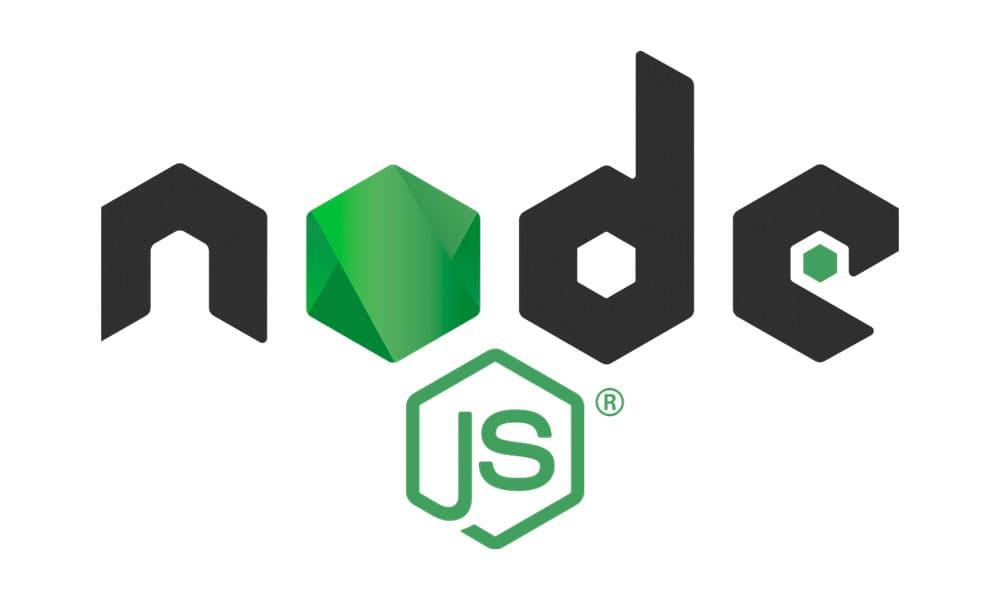
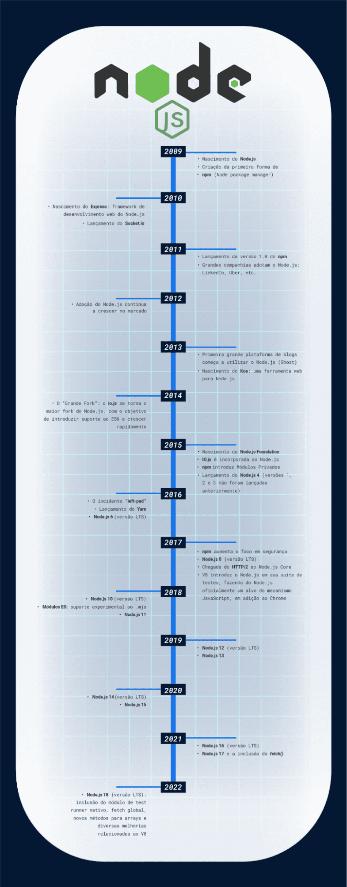

# Node.JS: o que é, como funciona esse ambiente de execução JavaScript e um Guia para iniciar

## Introdução

Na atualidade, a criação de **aplicações** tem como foco arquiteturas que sejam **escaláveis** e na entrega de **soluções em tempo real**, além da atenção à componentização e segurança.

Além disso, soma-se a esse cenário a revolução iniciada pelos smartphones, com o uso cada vez mais intenso das mídias sociais e o aumento de soluções de IoT (Internet das Coisas). Nesse contexto, os paradigmas conhecidos no desenvolvimento de aplicações também têm passado por diversas mudanças que vão do Front-end ao Back-end, onde pensamos cada vez mais em uma **solução como um todo**, levando em consideração o **consumo de dados** e a **disponibilidade de infraestrutura**.

E é nessa conjuntura que nasce o Node.js, surgindo como uma solução poderosa e barata para a criação e a manutenção de ambientes de tecnologia com altas demandas. Então, vamos conhecer um pouco sobre essa ferramenta?

## O que é Node.JS?

O JavaScript figura hoje como uma das linguagens mais utilizadas, e em grande parte isso se deve ao fato de ser uma linguagem base para dezenas de frameworks com alta popularidade e adesão na comunidade de desenvolvimento.

Por se tratar de uma linguagem popularmente conhecida para a construção de aplicações web mais interativas, o JavaScript possui grande foco no Front-end (client side), ou seja, é comumente utilizada para rodar no “lado cliente” da aplicação. Com a evolução das tecnologias web, tornou-se possível fazer o **JavaScript rodar também no Back-end**, e é nesse momento de consolidação de tecnologias e soluções que surge o Node.js.

Mas, afinal, o que é o Node.js? **O Node.js é um ambiente de execução do código JavaScript do lado servidor** (server side), que na prática se reflete na possibilidade de criar aplicações standalone (autossuficientes) em uma máquina servidora, sem a necessidade do navegador.

- ### Link You Tube

- ### [O que é o NODE.JS](https://www.youtube.com/watch?v=8VSTrZY8vwI)

## A História do Node.JS

O Node.js nasceu em 2009 como uma resposta às tentativas de rodar códigos JavaScript em modo server side, uma vez que a linguagem tinha como meta principal a manipulação do DOM (Document Object Model) e deixar as aplicações web mais interativas e dinâmicas.

Soma-se a isso o fato de que pessoas desenvolvedoras de JavaScript trabalham com uma linguagem simples, interpretada e que não necessita da instalação de ferramentas complexas de desenvolvimento.

Esses são alguns dos fatores motivadores do criador do projeto do Node.js, o **engenheiro de software Ryan Dahl**, responsável por esse ambiente de execução do código JavaScript fora do navegador, no lado servidor.

## Linha do tempo

Abaixo, temos uma **linha do tempo** do Node.js, passando pelo seu nascimento até a atualidade:

### [Menu Guia de Mergulho](menu.md)