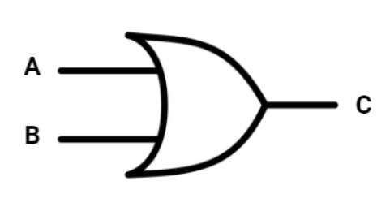

# Portas lógicas: entendendo os tipos e características

## Introdução

Portas lógicas desempenham um papel crucial em uma variedade de dispositivos, desde o microcontrolador de um simples microondas até os circuitos sofisticados de computadores super modernos, com capacidade de processamento avançada.

Apesar de ser um assunto importante que, geralmente, nos acompanha desde o início da trajetória nos estudos sobre tecnologia, é comum que também surjam dúvidas em relação a esse tema devido à sua complexidade.

Pensando nisso, ao longo desse artigo, vamos compreender de uma vez por todas o que são as portas lógicas em nível material e abstrato, qual sua importância, e como funcionam as expressões lógicas nos sistemas que desenvolvemos.

## Circuitos Integrados

Não é novidade que os computadores modernos funcionam com componentes eletrônicos. Coleções de capacitores, resistores, diodos e transistores, quando associados a uma placa, são responsáveis pelo controle do fluxo da corrente, ou seja, **fazem o controle de pulsos/sinais digitais para a placa**.

Tudo bem, mas o que isso significa?

Isso implica na capacidade de **permitir** ou **bloquear** a passagem de pulsos eletrônicos, assemelhando-se a uma porta, que abre e fecha. Por sua vez, esses sinais são interpretados como “Ligado” ou “Desligado”, “1” ou “0” , “Sim” ou “Não”, “Verdadeiro” ou “Falso”. Isso te lembrou alguma coisa?

Sim, são os binários! A base de toda a programação tem sua parte física, toda a combinação de códigos binários é interpretada por sua representação dos níveis de tensão elétrica. Não é um número de fato, é um estado, ligado e desligado!

Além dos binários, talvez você tenha associado o conceito de verdadeiro e falso há práticas muito comuns no universo da programação, que são os valores booleanos True e False. Sim, essa associação está correta! Antes das pessoas imaginarem os computadores como são hoje, a lógica desenvolvida por George Boole já tinha um papel importante na adaptação desses conceitos que chegaram ao mundo da eletrônica digital apenas no século XX, com Claude Shannon.

Shannon analisou os circuitos e buscou aplicar a teoria de Boole para solução de problemas, que resultou no que conhecemos como **Portas Lógicas**.

Sintetizando, é a partir dessa premissa que os computadores modernos são capazes de criar e processar tudo que realizamos de forma digital até então, como imagens, músicas, texto, softwares dos simples aos mais complexos e etc. A beleza disso é trabalhar com um conceito que parece ser simples e transformá-lo em coisas incríveis!

Qualquer sistema digital tem sua base construída por portas lógicas, de microprocessadores como arduino a computadores com processadores mais avançados. Os sistemas digitais são construídos com **circuitos lógicos** agrupados e embutidos em Circuitos Integrados(CI), que são os componentes utilizados para cumprir tarefas específicas.

Circuito Integrado 74HC08 Porta AND, um pedaço pequeno de metal na cor preta que tem espécies de pequenos ramos em metal nas laterais.

Fonte: https://www.usinainfo.com.br/porta-logica/

Nesse sentido, as portas lógicas podem ser utilizadas desde um nível de Integração de Ultra Larga Escala (ULSI - Ultra-large-scale Integration), que se caracteriza por um grupo de circuitos integrados com mais de 100 mil portas lógicas, até circuitos digitais mais simples, como na Integração em Pequena Escala (SSI - Short Scale of Integration).

As combinações realizadas com portas lógicas podem ser chamadas de **expressões lógicas** e permitem a descrição entre a tomadas de decisões, que são as saídas dos circuitos lógicos, e os inputs (entradas de informação). Podemos chamar a matemática das expressões lógicas de **álgebra de chaveamento**. O funcionamento é semelhante ao da álgebra que estudamos no ensino médio, com letras ou símbolos que representam operações lógicas e operadores. No entanto, há alguns pontos que distinguem a álgebra de chaveamento:

- Há somente dois resultados possíveis dentro de uma operação lógica: 0 que indica falso ou 1 que indica verdadeiro.
- Para representar e analisar os circuitos lógicos e seus resultados, algumas técnicas podem ser utilizadas, tais como a **tabela verdade, diagramas de tempo, símbolos esquemáticos e linguagens de descrição**.
- Os três tipos principais de portas lógicas são: AND, OR, NOT.

Para o desenvolvimento de software, os circuitos lógicos atuam com condições para que um determinada ação ocorra. Eles recebem uma entrada com o estado em binário, realizam a operação e devolvem o resultado.

Nesse momento, talvez surja a dúvida sobre " como devo representar esses valores binários? 0 e 1? Sim e Não? Verdadeiro e falso?"

Podemos utilizar todas essas formas de representação, conforme apresenta o quadro a seguir:

|**Valor**	|**Estado**	|**Nível Lógico**	|**Verdadeiro/Falso**|
|------|--------|-------------|---------|
|0	|Desligado	|LOW	|Falso|
|1	|Ligado	|HIGH	|Verdadeiro|

Os valores nível lógico alto (HIGH) e nível lógico baixo(LOW) estão relacionados à tensão da corrente elétrica, em que HIGH é o máximo e LOW é desligado. Não devemos confundir com a complexidade das operações lógicas.

Já entendemos que as portas lógicas armazenam estados de tensão elétrica que são convertidos em sinais binários. Em decorrência disso, realizam determinados tipos de operações e devolvem um valor como resultado, culminando no que entendemos por expressão lógica.

Vamos conhecer algumas dessas operações através das portas lógicas a seguir!

## Porta Lógica AND (E)

Essa porta pode aceitar como entrada (input) A e B, e aceita dois operandos, que são binários simples, ou seja, 0 e 1, representando respectivamente desligado e ligado.

No uso cotidiano de computadores a aplicação desse conceito é realizada com frequência na transferência de informações da memória para a CPU, pois garante que o bit de origem seja o mesmo de destino. Além disso, o “AND” pode corresponder a uma instrução If , ou seja uma estrutura condicional “SE”, permitindo a criação de várias condições dentro do seu programa.

Vamos entender analisando o seu funcionamento?

A figura que representa a porta AND é a seguinte:

A e B são as entradas, que por sua vez são multiplicadas e a saída, ou seja, o resultado é C.

Vamos entender de uma forma ainda mais simples. Abaixo nós temos um circuito em série para acender uma lâmpada que possui duas chaves. A lâmpada somente irá acender se as chaves A e B estiverem fechadas, ou seja, ligadas (com o valor de 1), pois assim o circuito ficará fechado e a corrente elétrica irá passar.

A animação apresenta um retângulo, onde há uma lâmpada no canto inferior direito, na parte inferior há duas linhas que se abrem e fecham, completando o retângulo e que representam as entradas A e B. Na linha da lateral esquerda é duas pequenas linhas na vertical que indicam uma fonte de energia, representando um circuito elétrico. Quando as chaves A e B estão fechadas, a lâmpada fica acesa. A aberto e B fechado, a lâmpada fica apagada. A fechado e B aberto, a lâmpada fica apagada. A e B abertos, a lâmpada fica apagada.

Fonte: CreativeOps

A partir da premissa da multiplicação dos valores lógicos, é possível criar uma tabela-verdade para entendermos as entradas de valores, qual o caso em que a lâmpada ficará acesa e quais os resultados obtidos.

### Porta AND (A.B = C)

|**Entrada A**|**Entrada B**|**Saída C**|**Verdadeiro/Falso**|
|------------|-------------|--------|--------|
|0	|0	|0	|Falso|
|1	|0	|0	|Falso|
|0	|1	|0	|Falso|
|1	|1	|1	|Verdadeiro|

Conforme é apresentado na tabela, “0” representa o estado desligado e “1” ligado.

## Porta Lógica OR (OU)

A porta OR simula uma adição ou soma de binários. Analise a seguinte imagem:

Novamente A e B representam a entrada de 0 ou 1, o símbolo arqueado com as extremidades pontiagudas é a representação da operação de adição, ou seja, o operador OR.

E o que essa expressão significa na prática?

A porta OR produz uma saída verdadeira (1) quando pelo menos uma das entradas é verdadeira (1). Na programação, por exemplo, a porta OR é usada em operações lógicas para criar condições em que uma ação ocorrerá se pelo menos uma das condições for verdadeira.

Vamos entender com o circuito simples? Analise a imagem:

O que acontece em nosso circuito? A lâmpada irá acender **se** a chave A **ou** B estiver ligada, ou seja, se o seu valor corresponder a 1. Interessante como é semelhante a lógica de programação, não é verdade? Vamos analisar a tabela na sequência para entendermos os resultados esperados através das operações com a porta Lógica OR:

### Porta OR (A+B = C)

|**Entrada A**|	**Entrada B**|	**Saída C**|	**Verdadeiro/Falso**|
|---------|-----------|---------------|--------|
|0	|0	|0	|Falso|
|0	|1	|1	|Verdadeiro|
|1	|0	|1	|Verdadeiro|
|1	|1	|1	|Verdadeiro|

## Porta Lógica NOT (Negação)

Imagine que você tenha um botão "Ativar/Desativar" em uma interface de usuário de um software em desenvolvimento. A ideia é alternar o estado do sistema sempre que o botão for pressionado. Você pode utilizar a porta NOT, pois com sua aplicação é possível inverter o valor de um estado.

A porta NOT funciona como um inversor e possui somente uma entrada ou operando A, um dígito 0 ou 1. Sua utilização em nível de hardware também é caracterizada pela inversão de um sinal, como na criação de memórias de acesso aleatório (RAM) ou na execução de operações de negação.

Ok, entendemos que a porta NOT inverte o valor recebido, mas podemos consolidar esse aprendizado através das imagens a seguir:

A bola na ponta direita do triângulo deitado significa que há uma inversão. Por fim, a expressão C = A representa que o resultado é a inversão do dígito de entrada.

Sendo assim, a tabela-verdade se apresenta da seguinte forma:

### Porta NOT (C = A)

|**Entrada A**|	**Saída C =A**|	**Verdadeiro/Falso**|
|----------|-----------|------------|
|0	|1	|Verdadeiro|
|1	|0	|Falso|

Agora, confira a imagem com um circuito que representa esse processo:

Note que, na imagem acima, temos uma lâmpada ligada a uma fonte de tensão. O botão A começa com o nível lógico alto e a lâmpada fica apagada. Quando o botão A for clicado, o seu estado irá mudar para um nível lógico baixo e a lâmpada acenderá.

A partir das principais operações, houve a criação de variações para ampliar as possibilidades. Vamos conhecer essas variações a seguir!

## Porta Lógica XOR (OU exclusivo)

O OU exclusivo, também conhecido como disjunção exclusiva, tem como principal função verificar a igualdade entre os valores de entrada, e por isso é aplicado na criação de testadores. A saída será verdadeira se, e somente se, as duas entradas forem diferentes.

Dessa forma, o resultado será falso sempre que os valores de A e B forem iguais.

Portas XOR em desenvolvimento de software podem ser úteis para comparação de dois conjuntos de dados. É possível encontrar elementos que são exclusivos em cada conjunto. Por exemplo, se você tem duas listas e quer encontrar os elementos que estão em apenas uma delas, a lógica XOR pode funcionar. Por outro lado, em nível de hardware, o conceito de portas XOR são utilizados para verificar se duas entradas são diferentes e adicionar números binários.

A animação acima demonstra o funcionamento da porta XOR, que pode ser sintetizada pela pergunta: **A é igual a B? Se sim, o valor C é falso**.

Temos as representações do estado de OU exclusivo quando duas portas apresentam o mesmo nível lógico, estão ligadas ou desligadas, a lâmpada não acende. Por outro lado, quando existe a diferença entre níveis lógicos na entrada, a saída é Verdadeiro, ou seja, a lâmpada irá acender.

Assim, a tabela-verdade seria:

### Porta XOR (AB = C)

|**Entrada A**|	**Entrada B**|	**Saída C**|	**Verdadeiro/Falso**|
|------------|------------|-----|------------|
|0	|0	|0	|Falso|
|0	|1	|1	|Verdadeiro|
|1	|0	|1	|Verdadeiro|
|1	|1	|0	|Falso|

## Porta Lógica NAND (Não E)

Essa porta combina as operações AND(E) e NOT(Negação), funciona como a inversão da porta AND. O processo para obter o resultado da operação é realizar primeiro o cálculo da porta AND e depois inverter o seu valor.

As portas NAND são fundamentais para implementação de funções lógicas, um exemplo é que elas podem ser utilizadas para criação de somadores binários.

Outro caso de uso já no desenvolvimento de sistemas, é quando você precisa certificar que um usuário não terá acesso ao sistema, se condições como nome de usuário correto e senha correta não forem atendidas.

Símbolo da Porta lógica NAND: há duas entradas com a descrição de A e B que são linhas e se conectam a uma figura semelhante a um quadrado, mas que possui a lateral direita arredondada, com uma bolinha no ponto mais externo da curva. Há uma linha horizontal saindo do meio da lateral direita que representa a saída da operação.
Sua representação em um circuito simples funciona como na imagem a seguir:

A lâmpada apaga somente quando as duas entradas estão fechadas, com um valor de 1, pois isso gera um curto-circuito no circuito. Interessante, não é? Vamos conferir a tabela-verdade da porta NAND?

### Porta NAND (C = A.B)

|**Entrada A**|	**Entrada B**|	**Saída C**|	**Verdadeiro/Falso**|
|----------|----------------|-----------|----------|
|0	|0	|1	|Verdadeiro|
|1	|0	|1	|Verdadeiro|
|0	|1	|1	|Verdadeiro|
|1	|1	|0	|Falso|

### Porta NOR (NÃO OU)

A porta NOR é a negação dos valores de saída da porta OR.

Um caso para seu uso é durante a construção de sistema de controle de iluminação, você pode criar uma condição de desligamento geral com a porta NOR: SE nenhuma das condições de acionamento das luzes for verdadeira, todas as luzes se apagarão.

Assim como a porta NAND, a porta NOR também é uma porta universal e pode ser usada para implementar qualquer função lógica em circuitos digitais. Vamos conhecer sua simbologia a seguir:

Como podemos notar, a bolinha na saída indica a negação da operação de com os dados de entrada. O resultado é algo similar a representação do circuito simples abaixo:

No circuito, a lâmpada fica acesa apenas quando todas as entradas são 0.

Podemos representar a tabela-verdade da porta NOR através da expressão C = A+B . Vamos analisar na sequência os valores de saída?

### Porta NOR ( C = A+B )

|**Entrada A**|	**Entrada B**|	**Saída C**|	**Verdadeiro/Falso**|
|-----------|------------|---------------|--------|
|0	|0	|1	|Verdadeiro|
|0	|1	|0	|Falso|
|1	|0	|0	|Falso|
|1	|1	|0	|Falso|

### Porta Lógica XNOR (Negação do OU exclusivo)

A negação do OU Exclusivo , conhecida também como NOR, que significa coincidência, resulta em um valor de alto nível se, e somente se, todas as variáveis de entrada forem iguais.

A sua representação algébrica consiste em AB e o seu símbolo é a imagem do XOR com a bolinha de negação em sua saída, como na imagem a seguir:

A Porta XNOR funciona como um comparador de igualdade, pois identifica valores de entrada iguais. Vamos entender com o desenho de um circuito simples?

A lâmpada se mantém acesa quando A e B apresentam valores iguais e apagada quando as entradas possuem níveis lógicos diferentes.

A representação da tabela-verdade segue o princípio de inversão do resultado de saída da porta NOR, que é:

### Porta XNOR (AB = C)

|**Entrada A**|	**Entrada B**|	**Saída C**|	**Verdadeiro/Falso**|
|----------|----------|-----------|---------|
|0	|0	|1	|Verdadeiro|
|0	|1	|0	|Falso|
|1	|0	|0	|Falso|
|1	|1	|1	|Verdadeiro|

Sua expressão completa pode ser definida como C =AB = AB + AB = A ⊙ B

### Conclusão

Até aqui aprendemos muito sobre as portas lógicas, mas você pode estar se perguntando “Como tudo isso ajuda aprimorar minhas habilidade de dev?”.

A escolha da porta lógica adequada nos permite compreender o funcionamento dos computadores em nível de hardware e também de software. Assim, é possível desenvolver a lógica de seus programas com o estudo das expressões e suas representações nas condições que o sistema precisa.

Nesse sentido, é possível utilizar tudo que abordamos sobre portas lógicas para otimizar programas e seus resultados, a partir da abstração de sua lógica de funcionamento. Não é incrível?!

Isso significa que não basta saber o que são ou quais são as portas lógicas, ou mesmo decorar as saídas de todas as expressões. O fundamental é entender como o seu funcionamento impacta a sua atuação como pessoa desenvolvedora.

Lembrando que as portas lógicas podem ter mais de uma ou duas entradas, assim como existem diversas combinações entre expressões para a criação de sistemas. Dessa forma, você pode aprofundar os estudos sobre o tema e **exercitar sempre**!

- ### [Artigo de Camila Pessôa para a ALURA](https://www.alura.com.br/artigos/o-que-e-json)

### [Menu Guia de Mergulho](menu.md)
