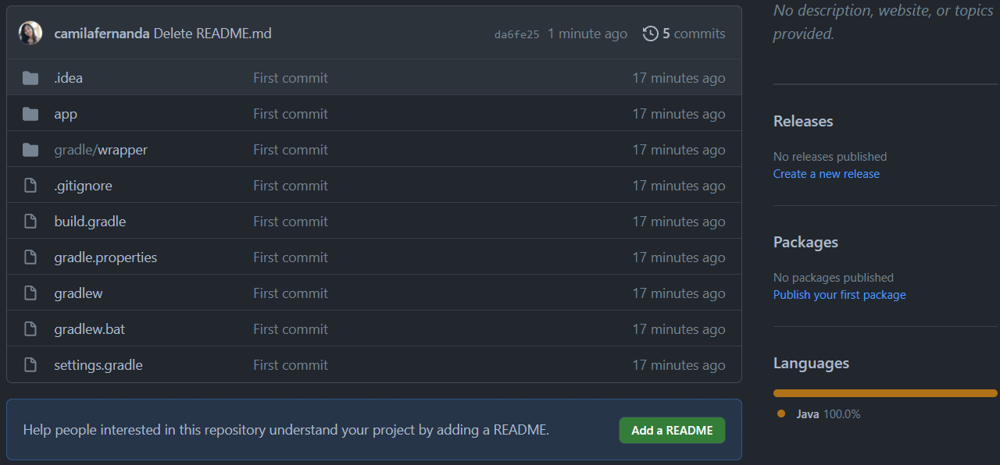
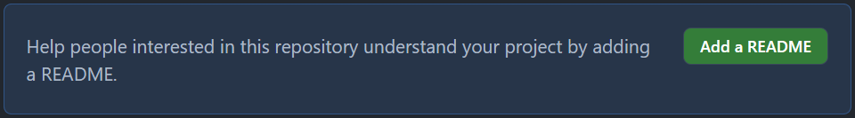
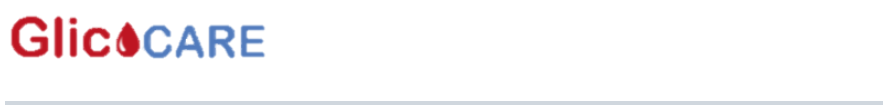
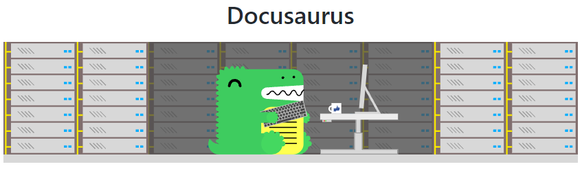
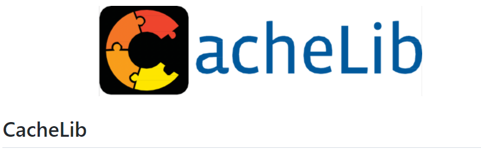
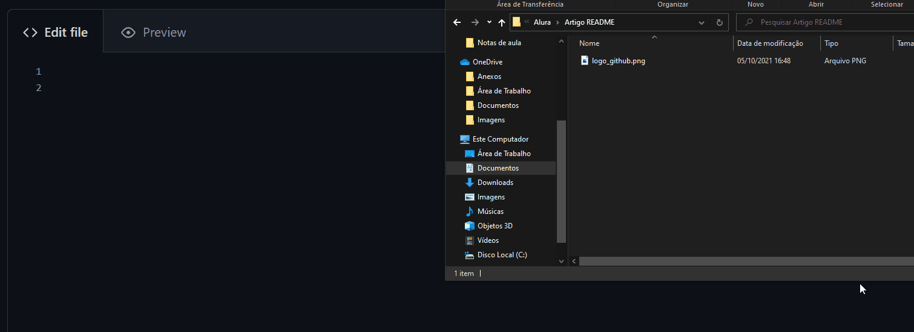
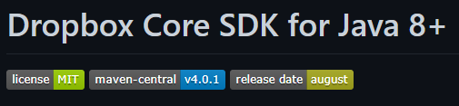
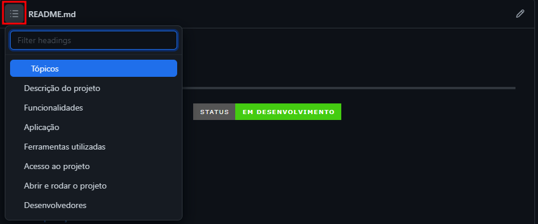
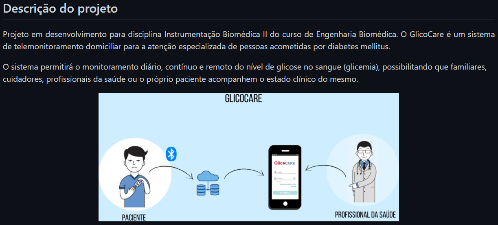

# Como escrever um README incrível no seu Github


Tendo em vista o mesmo projeto em repositórios remotos no GitHub, a famosa rede social da pessoa que desenvolve, qual das duas abordagens abaixo é mais atrativa para você?


Repositório: GlicoCare2


Repositório: GlicoCare

Com certeza a segunda opção, não é mesmo? Pois na primeira opção nem iríamos saber direito do que se trata o projeto. E o diferencial do segundo repositório foi a adição de um arquivo **README** bem bacana que deixou o projeto mais atrativo e explicativo.

## O que é README? Leia-me, o que seria isso?

O README é um arquivo com extensão .md, ou seja, ele é escrito em **Markdown** que é uma linguagem de marcação utilizada para converter o texto em um HTML válido. Caso queira saber mais sobre, temos esse artigo que explica muito bem como funciona e como escrever anotações com essa linguagem.

Nas plataformas de repositórios remotos, como o **GitHub**, a função desse arquivo é apresentar informações do projeto, como:

- Descrição do seu projeto;
- Funcionalidades;
- Como os usuários podem utilizá-lo;
- Onde os usuários podem encontrar ajuda sobre seu projeto;
- Autores do projeto.

## Por que fazer um README?

Depois de trabalhar bastante e desenvolver seu projeto bacana, provavelmente você irá subir para o GitHub e mostrar para comunidade o que você fez.

Para isso, é legal documentar o projeto para quem for visitar seu repositório saiba do que se trata, assim como foi visto no primeiro exemplo.

E podemos fazer isso por meio do **README**, que é o primeiro arquivo a ser visto, ou seja, é a porta de entrada para o seu projeto. O próprio GitHub faz essa recomendação ao subir algum projeto sem esse arquivo:



```
Tradução: Ajude as pessoas interessadas neste repositório a entender seu projeto adicionando um README.
```

Além disso, algumas pessoas utilizam o perfil GitHub como portfólio, se esse for o seu caso, é interessante apostar em arquivos README para deixar seus projetos mais atrativos até mesmo para recrutadores, como explicado nesse artigo da Jornada de um estagiário. Caso esse não seja o seu objetivo, é válido destacar que nem sempre queremos que os usuários se interessem ou colaborem com nosso repositório, nesses casos é dispensável o uso desse arquivo.

## O que é bacana de se ter em um README

Analisando repositórios famosos, é possível notar a presença de arquivos README bem legais.

Como esse repositório **Docusaurus do Facebook**, que é um projeto feito para auxiliar a construir, implantar e manter sites de projetos de código aberto.


E o projeto **Open MCT da Nasa** que é utilizado para análise de dados de missões de espaçonaves, bem como planejamento e operação de sistemas de rover experimentais.


É possível notar que os dois não possuem um padrão exatamente igual, cada um possui sua identidade. Porém, conseguimos ver alguns pontos que podemos destacar que são legais de se ter no seu README, como:

- Título e Imagem de capa;
- Badges;
- Índice;
- Descrição do Projeto;
- Status do Projeto;
- Funcionalidades e Demonstração da Aplicação;
- Acesso ao Projeto;
- Tecnologias utilizadas;
- Pessoas Contribuidoras;
- Pessoas Desenvolvedoras do Projeto;
- Licença.

## Título e Imagem de capa
Assim que você adicionar um README, ele já irá iniciar com o título sendo o nome do seu repositório. Mas você pode mudar ele e colocar um nome descritivo. Nesse momento abuse da criatividade.

Ao escolher o título, você pode colocá-lo dessa maneira:

```
# Seu título aqui
```

Ou, caso queira colocar ele **centralizado**, você pode utilizar **tags do HTML** que funcionam normalmente, dessa forma:

```
<h1 align="center"> Seu título aqui </h1>
```

Feito isso, caso queira, você pode fazer uma capa ou logo do projeto para colocar após o título. Particularmente, gosto bastante do Canva para fazer artes, com o plano gratuito já é possível encontrar algumas ferramentas legais.

Eventualmente, caso a logo for uma arte do título, como no exemplo do **GlicoCare**, ela pode substituir o título:



Porém, pode ser utilizados os dois também, como utilizado no **Docusaurus**:



Ou **CacheLib do Facebook** também:



Mas como colocar a imagem no arquivo? Assim que você fizer ou encontrar sua arte, você pode abrir ela no explorador de arquivos e arrastá-la para o arquivo do README em edição, segue um exemplo feito no Windows:



Dentro dos colchetes `[]`, irá aparecer o nome do arquivo da imagem como descrição, mas é interessante que você descreva detalhadamente do que se trata para ajudar na **acessibilidade**. E dentro dos parênteses aparece um link da sua imagem que o GitHub gera ao converter e hospedar ela.

Outra maneira de colocar imagem, que é mais segura, seria subindo a imagem para **seu próprio repositório** ou utilizando **serviços de hospedagem de imagens** como o **imgur** ou o **pasteboard** e colocar o link gerado em markdown, dessa forma:

```

```

Você também pode utilizar imagens disponibilizadas na internet pegando o link e colocando da mesma forma citada anteriormente, porém não é recomendado, pois pode ocorrer que a imagem seja deletada e seu repositório fique sem ela depois.

## Badges

Alguns repositórios utilizam **badges**, que na tradução literal é distintivo, emblema ou insígnia. Seus objetivos são indicar o **estado atual do projeto, licença** caso tenha, versões, dependências, testes e entre outros.

Um exemplo do uso de badges em um repositório do Dropbox, o *Dropbox Core SDK for Java 8+*:



Nele foi utilizado badges para:

- **Licença**: Instituto de Tecnologia de Massachusetts (MIT);
- **Versão da ferramenta de gerenciamento de dependências, Maven**: versão 4.0.1;
- **Data da última versão do projeto**: agosto.

Caso queira fazer suas badges, você pode utilizar o [Shields.io](https://shields.io/), ele fornece na página principal diversos exemplos de Badges e, além disso, nele você pode colar o link do seu repositório do GitHub na caixa de texto inicial, assim automaticamente ele irá sugerir algumas Badges para você utilizar no seu projeto, fornecendo o link da Badge para copiar e colar no seu README.


Exemplos:

1. ### Status do projeto:

Código gerado:

```

```

Resultado:


Caso queira deixar centralizado, pode utilizar a tag align do HTML também, dessa forma:

```
<p align="center">

</p>
```

2. ### Stars do projeto:

Código gerado:

```

```


## Índice

O **GitHub** gera **automaticamente** um índice para arquivos README, tendo como base os títulos da seção. Para visualizá-lo, selecione o ícone de menu no canto superior esquerdo do arquivo.



Principalmente em READMEs extensos, essa é uma ferramenta excelente para navegar pelo documento, pois redireciona o usuário para o tópico selecionado.

Entretanto, caso você tenha interesse em fazer seu próprio índice para ser visualizado no arquivo, também é possível fazer em Markdown.

Exemplo:

```
# Índice 

* [Título e Imagem de capa](#Título-e-Imagem-de-capa)
* [Badges](#badges)
* [Índice](#índice)
* [Descrição do Projeto](#descrição-do-projeto)
* [Status do Projeto](#status-do-Projeto)
* [Funcionalidades e Demonstração da Aplicação](#funcionalidades-e-demonstração-da-aplicação)
* [Acesso ao Projeto](#acesso-ao-projeto)
* [Tecnologias utilizadas](#tecnologias-utilizadas)
* [Pessoas Contribuidoras](#pessoas-contribuidoras)
* [Pessoas Desenvolvedoras do Projeto](#pessoas-desenvolvedoras)
* [Licença](#licença)
* [Conclusão](#conclusão)
```

### Resultado:

- Título e Imagem de capa
- Badges
- Índice
- Descrição do Projeto
- Status do Projeto
- Funcionalidades e Demonstração da Aplicação
- Acesso ao Projeto
- Tecnologias utilizadas
- Pessoas Contribuidoras
- Pessoas Desenvolvedoras do Projeto
- Licença
- Conclusão

## Descrição do Projeto

Como é um objetivo do arquivo README **descrever o projeto**, é legal que você apresente logo após o título ou imagem de capa e/ou Badges caso tenha, uma breve explicação do seu projeto com seu objetivo principal.

Ou pode detalhar mais, como feito no projeto **GlicoCare** e apresentar figuras que exemplificam o projeto, caso tenha:




- ### [Artigo de Camila Fernanda Alves Hillman para a Alura](https://www.alura.com.br/artigos/escrever-bom-readme)

### [Menu Publicando na Google Cloud: Configuração de API e Integração com Gemini](menu.md)