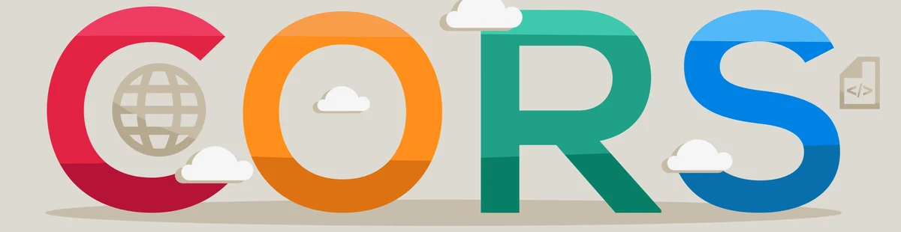
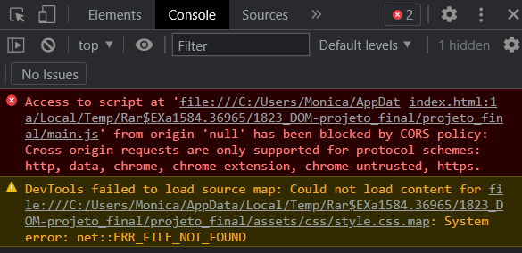

# O que é CORS e como resolver um erro de Cross-Origin Resource Sharing (CORS)?

Introdução: o problema de CORS
Você já deve ter passado pela situação de estar tentando logar em alguma aplicação, digita seus dados, clica no enviar e não acontece nada na página. A primeira coisa que uma **pessoa desenvolvedora** faz é inspecionar a página e seguidamente abre o console do navegador (clicando no botão F12 ou apertando com o botão direito do mouse, e na sequência em Inspecionar).

Você se depara com o **erro "blocked by CORS policy: Cross origin requests are only supported for protocol schemes: http, data, chrome-extension, edge, https, chrome-untrusted."** ou semelhante.

### Mas você sabe o que causa isso?

## Política de mesma origem: Same-origin policy

A política de mesma origem (same-origin policy) é um mecanismo de segurança que restringe a maneira de um documento ou script de uma origem interagir com o recurso de outra origem. E para que isso serve? Ajuda a evitar ataques maliciosos.

Duas URLs compartilham a mesma origem se o protocolo, porta (caso especificado) e host são os mesmos. Considere a URL `https://cursos.alura.com.br/category/front-end`, vamos comparar possíveis variações:

|URL	|**Resultado**	|**Motivo**|
|-----|---------|-----|
|`https://cursos.alura.com.br/category/programacao`|	Mesma origem|	Só o caminho difere|
|`https://cursos.alura.com.br/category/front-end/html-css`|	Mesma origem|	Só o caminho difere|
|`http://cursos.alura.com.br/category/front-end`|	Erro de CORS|	Protocolo diferente (http)|
|`https://cursos.alura.com.br:80/category/front-end`|	Erro de CORS	|Porta diferente (https:// é porta 443 por padrão)|
|`https://store.alura.com.br:80/category/front-end`|	Erro de CORS|	Host diferente|

Mas, analisando essas variações, como lidamos com situações em que nosso front-end precisa consumir uma **API com url diferente** sem termos problemas com o **CORS**? Como no caso de querermos conectar uma API que roda na **porta 8000** com uma aplicação React rodando **na porta 3000**?

Ao enviar uma requisição para uma API de origem diferente, o servidor precisa retornar um header chamado **Access-Control-Allow-Origin**. Dentro dele, é necessário informar as diferentes origens que serão permitidas, por exemplo:

- `Access-Control-Allow-Origin: http://localhost:3000/`
É possível permitir o acesso de qualquer origem utilizando do símbolo asterisco, veja a seguir:

- `Access-Control-Allow-Origin: *`
Isso não é uma medida recomendada pois permite que origens desconhecidas acessem o servidor, a não ser que seja intencional como no caso de uma API pública.

## O que é o CORS?

O CORS (Cross-origin Resource Sharing) é um **mecanismo usado para adicionar cabeçalhos HTTP** que informam aos navegadores para permitir que uma aplicação Web seja executada em uma origem e acesse recursos de outra origem diferente. Esse tipo de ação é chamada de **requisição cross-origin HTTP**.

É usado para habilitar solicitações entre sites para chamadas **XMLHttpRequest** ou **FetchAPI** (entre origens diferentes), **web fonts** (@font do CSS), **texturas WebGL** e frames de desenhos usando o `drawImage()`.

Para saber mais sobre o **protocolo HTTP** e entender mais sobre o **funcionamento do CORS**, temos diversos conteúdos para você:

- [HTTP: Desmistificando o protocolo da Web](https://www.alura.com.br/artigos/http)
- [HTTP: Entendendo a web por baixo dos panos](https://www.alura.com.br/curso-online-http-entendendo-web-por-baixo-dos-panos)
- [HTTP: GET e POST - Conheça as diferenças entre os métodos](https://www.alura.com.br/artigos/diferencas-entre-get-e-post)
- [Qual é a diferença entre HTTP e HTTPS?](https://www.alura.com.br/artigos/qual-e-diferenca-entre-http-e-https)

- ### [Artigo de Mônica Mazzochi Hillman para a Alura](https://www.alura.com.br/artigos/como-resolver-erro-de-cross-origin-resource-sharing)

### [Menu Publicando na Google Cloud: Configuração de API e Integração com Gemini](menu.md)