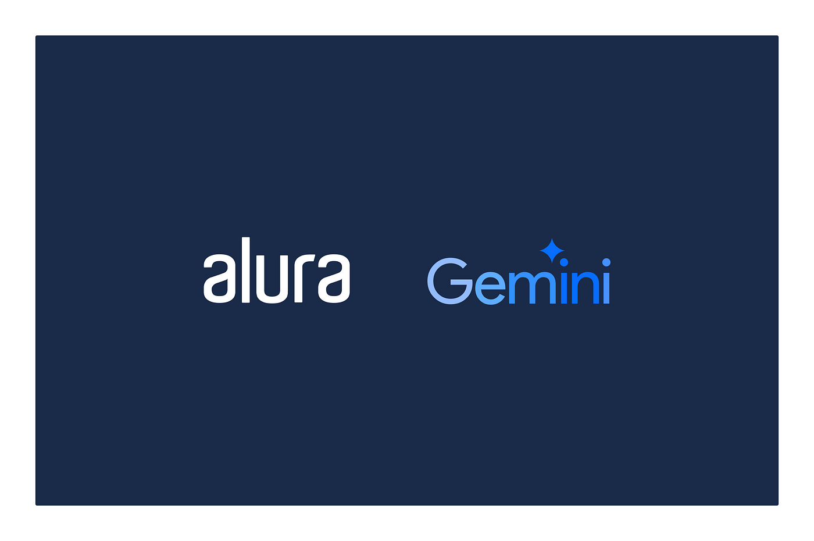

# Imersão Dev Back-End

**Imersão IA**, um mergulho em Inteligência Artificial com cinco aulas gratuitas para aprender na prática a desenvolver projetos do zero com o **Gemini API** e o **Google AI Studio**.

## 📚 Temas abordados

- ### [Guia de Mergulho](Guia-Mergulho/menu.md)

- ### [Criando e Estruturando sua Primeira API com GET e Banco de Dados](Estruturando-API-Banco-Dados/menu.md)

- ### [Conectando sua API ao MongoDB: Estrutura, Conexão e Refatoração](ConectandoAPI/menu.md)

- ### [Implementando Armazenamento e Upload de Imagens](Armazenamento-Uploads-Imagens/menu.md)

- ### [Publicando na Google Cloud: Configuração de API e Integração com Gemini](Publicando-Configurando/menu.md)

<h2> 📞 Contato</h2>

 

  

  

  

